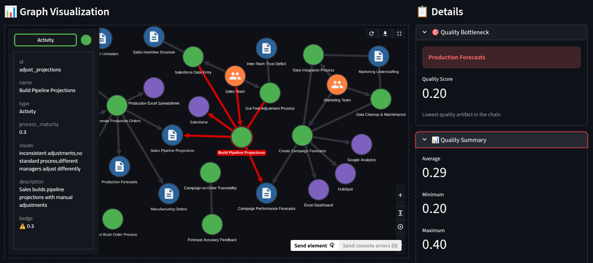

# AI Pilot Assessment Engine

**This tool helps you discover and describe your operational problems through natural conversation**, turns that into a simple visualization and graph analysis, then considering your needs and capabilities, helps you find the ideal data engineering or AI project.

<details>
<summary><b>📖 See a Real Example: Cascading Failures Across Marketing, Sales, and Production</b></summary>

---

<i>Look, I'll try to explain what's happening here, but honestly, it's a mess and I'm not even sure where to start. We have this whole chain of forecasts and plans that flow from marketing through sales to production planning, and somewhere along the way everything gets distorted, but nobody can tell me exactly where or why.

So it starts with marketing. They create these campaign performance forecasts in HubSpot - you know, expected leads per campaign, conversion estimates, that kind of thing. The problem is, their forecasts are based on historical data that's scattered across three different tools. Some of it lives in HubSpot, some in Google Analytics, and some in this old Excel dashboard that nobody maintains anymore. The marketing team pulls numbers from wherever they can find them, but there's no single source of truth. Half the time they're working with stale data because nobody updates the Excel file, and the Google Analytics integration keeps breaking. So their campaign forecasts are already questionable before they even hand them off.

Then sales takes those marketing forecasts and uses them to build their pipeline projections in Salesforce. But here's the thing - sales doesn't trust marketing's numbers. They've been burned before by overly optimistic projections, so they apply their own "gut feel" adjustments. Different sales managers adjust differently - some cut the numbers by 20%, others by 40%, there's no consistent process. These adjusted pipeline forecasts go into Salesforce, but the sales team is terrible about keeping Salesforce updated. They're always in meetings, always closing deals, and data entry is the last thing on their minds. So the pipeline data in Salesforce is perpetually out of date, sometimes by weeks.

Now production planning takes those sales pipeline forecasts from Salesforce and feeds them into their production scheduling spreadsheet. Yes, a spreadsheet - we don't have a proper production planning system. The production planning team manually exports data from Salesforce every Monday morning, copies it into their master Excel file, and uses that to generate production orders for the next month. But because the Salesforce data is already stale, and because there's a manual export process that sometimes gets delayed, the production forecasts are based on information that's often three to four weeks old.

Here's where it gets really painful. Production planning creates these manufacturing orders based on their forecasts, and those orders go to the factory floor. But nobody tracks which marketing campaign led to which sales pipeline entry, which led to which production order. The connections are completely lost. So when we end up overproducing - which we do, constantly - we have no idea whether it was because marketing over-forecasted, sales over-adjusted, production planning added their own safety buffer, or some combination of all three.

And we definitely overproduce. Our warehouses are full of inventory we can't move. But when I ask "where did this forecast error come from?", nobody can tell me. Marketing says their forecasts were fine. Sales says they adjusted conservatively. Production planning says they just used what sales gave them. Everyone's pointing fingers, but there's no data trail to follow back to the source of the error.

The worst part is the compounding effect. When marketing's forecast is off by 10%, sales might adjust it in the wrong direction and make it 15% off, then production planning adds their safety buffer and now we're 25% off. But we don't see these incremental distortions - we only see the final result, which is a warehouse full of products we can't sell.

And it's not like we can just fix one piece of this. The marketing team needs better data integration, but they're understaffed and don't have time to clean up their data sources. The sales team needs to update Salesforce more consistently, but they're measured on closed deals, not data quality, so why would they prioritize it? Production planning needs a real system instead of Excel, but that's a six-month IT project and we don't have the budget.

So we're stuck in this situation where everything kinda works - we do produce products, we do sell them, the business runs - but it's incredibly inefficient and we have no visibility into what's actually driving our results. We can't tell which marketing campaigns are truly effective because the data is too messy. We can't tell which sales adjustments are smart and which are paranoid because there's no feedback loop. We can't optimize production because we don't know which forecasts to trust.

I've tried to map this out, to understand the flow, but it's like trying to untangle a ball of yarn. Marketing's campaign forecasts affect sales pipeline projections, which affect production orders, which affect inventory levels. But there are also informal processes - sales managers calling production planning directly to rush orders, marketing running campaigns that never make it into the forecast, production planning holding back capacity "just in case". None of this is documented, none of this is tracked.

What I really need is to understand the whole system - not just the outputs, but how each team's work affects the next team's inputs, how each tool's limitations create workarounds, how each informal process introduces errors. Because right now, we're flying blind. We know we're overproducing, we know we're overstocked, but we don't know where to intervene to fix it. Do we need better marketing data? Better sales discipline? Better production planning tools? All of the above? I honestly don't know, and that's what's keeping me up at night.</i>

---

</details>

---
**→ The system turns this conversation into:**



*A clear graph showing dependencies, bottlenecks, and cascading failures across teams and systems*

A **conversational AI pilot recommendation system** that helps organizations identify AI opportunities through natural dialogue. The system assesses organizational outputs (deliverables, work products) through their contributing factors, identifies bottlenecks, and recommends targeted AI pilots to address them.

**Core Innovation:** Output-centric assessment with LLM-powered semantic inference for solution recommendations.

---

## 📊 Development Progress

```
Release 1.0  ████████████████████ 100% ✅ Core Assessment Engine
Release 1.5  ████████████████████ 100% ✅ Pre-Release 2 Prep
Release 2.0  ████████████████████ 100% ✅ Graph Storage
Release 2.1  ████████████████████ 100% ✅ Pattern Engine Foundation
Release 2.2  ████████████████░░░░  80% 🔄 Situational Awareness + Intent Detection (IN PROGRESS)
Release 2.5  ░░░░░░░░░░░░░░░░░░░░   0% 📋 Semantic Evaluation (PLANNED)
Release 3.0  ░░░░░░░░░░░░░░░░░░░░   0% 📋 Advanced Features (PLANNED)
```

**Current Status:** Days 1-12 complete | 79/79 tests passing (100%)  
**Latest:** Intent Detection with Gemini embeddings (Day 11-12) ✅  
**📋 [Complete Feature Map](docs/FEATURE_MAP.md)** - All features (implemented, in-progress, planned, future)  
**🧪 [Test Documentation](tests/README.md)** - Comprehensive test guide and results

---

## Quick Links

**🛠️ Configuration Management:** [`scripts/config_management/`](scripts/config_management/)
- **[Configuration Management System](scripts/config_management/README.md)** - **CRITICAL** - Unified CRUD for triggers, behaviors, patterns
- Quick commands:
  - `python scripts/config_management/manage.py list triggers` - List all triggers
  - `python scripts/config_management/manage.py show trigger T_NAME` - Show details
  - `python scripts/config_management/manage.py create trigger ...` - Add new trigger
  - See [full documentation](scripts/config_management/README.md) for complete guide

**📖 Documentation:**
- **Development Guidelines:** [`docs/dev_env_instructions/`](docs/dev_env_instructions/)
  - [Development Workflow](docs/dev_env_instructions/DEVELOPMENT_WORKFLOW.md) - Vertical slicing, UAT checkpoints
  - [Feature Ideas](docs/dev_env_instructions/FEATURE_IDEAS.md) - How to handle feature requests
  
- **Functional Specification:** [`docs/1_functional_spec/`](docs/1_functional_spec/)
  - [TBD (To Be Decided)](docs/1_functional_spec/TBD.md) - Feature ideas and design decisions
  - [User Interaction Patterns](docs/1_functional_spec/USER_INTERACTION_PATTERNS.md) - Canonical conversation examples
  - [Situational Awareness](docs/1_functional_spec/SITUATIONAL_AWARENESS.md) - Dynamic conversation management (no global phases)
  - [Representation Model](docs/1_functional_spec/REPRESENTATION.md) - Edge-based factor model
  - [Business Context Extraction](docs/1_functional_spec/BUSINESS_CONTEXT_EXTRACTION.md) - Natural constraint extraction
  - [Solution Recommendation](docs/1_functional_spec/SOLUTION_RECOMMENDATION.md) - LLM semantic inference
  - [Feasibility Assessment](docs/1_functional_spec/FEASIBILITY_AND_REPORTING.md) - Prerequisites and reporting
  
- **Technical Specification:** [`docs/2_technical_spec/`](docs/2_technical_spec/)
  - [Implementation & Deployment Plan](docs/2_technical_spec/IMPLEMENTATION_DEPLOYMENT_PLAN.md) - Complete technical roadmap
  - [Release 2.1: Pattern Engine](docs/2_technical_spec/Release2.1/README.md) - Conversation pattern system
  - [Release 2.2: Situational Awareness](docs/2_technical_spec/Release2.2/README.md) - Dynamic conversation management
  - [Release 2.5: Semantic Evaluation](docs/2_technical_spec/Release2.5/README.md) - Quality monitoring infrastructure

**🎯 Key Concepts:**
- [What This System Does](#what-this-system-does)
- [How It Works](#how-it-works)
- [Conversation UX](#conversation-ux)
- [Technical Architecture](#technical-architecture)

---

## What This System Does

### The Problem

Organizations struggle to identify which AI pilots to pursue because:
- **Combinatorial complexity:** 46+ outputs × 4 bottleneck types × 100+ pain points × 27 AI archetypes
- **Context matters:** Same bottleneck (e.g., "junior team") requires different solutions based on context
- **Stakeholder alignment:** Need comprehensive analysis for approval, not just quick recommendations

### The Solution

A conversational system that:
1. **Identifies struggling outputs** through natural dialogue ("Sales forecasts are always wrong")
2. **Assesses contributing factors** via edge-based model (People, Tools, Processes, Dependencies)
3. **Calculates bottlenecks** using MIN() - weakest link determines output quality
4. **Extracts business context** naturally (budget, timeline, visibility preferences)
5. **Recommends AI pilots** using LLM semantic inference (not hardcoded rules)
6. **Checks feasibility** against archetype prerequisites
7. **Generates comprehensive reports** for stakeholder approval (13-18 pages)

---

## How It Works

### 1. Edge-Based Factor Model

**Outputs are assessed through their contributing edges:**

```
Nodes:
  - Output (deliverable: Sales Forecast, Customer Support Ticket, etc.)
  - People (team archetype: Sales Ops - Junior, Data Engineers - Senior)
  - Tool (system: Salesforce CRM, Excel, Custom Dashboard)
  - Process (workflow: Forecasting Process, Data Entry Workflow)

Edges (the factors):
  - People → Output (team's effect on output quality)
  - Tool → Output (system's effect on output quality)
  - Process → Output (process's effect on output quality)
  - Output → Output (upstream dependency's effect)
```

**Each edge has:**
- **Evidence array:** User statements with confidence tiers (1-5)
- **Current score:** 1-5 stars (calculated via Bayesian aggregation)
- **Current confidence:** 0.0-1.0 (based on evidence weight)

**Output quality = MIN(all incoming edges)** - weakest link determines quality.

### 2. Evidence-Based Assessment

**Tier-weighted evidence aggregation:**
- **Tier 1:** AI inferred from indirect data (weight=1)
- **Tier 2:** User mentioned indirectly (weight=3)
- **Tier 3:** User stated directly (weight=9)
- **Tier 4:** User provided example (weight=27)
- **Tier 5:** User provided quantified example (weight=81)

**Bayesian-weighted ranking:**
- Multiple evidence pieces weighted by tier
- Regressed toward global average (μ=2.0) for low-confidence edges
- Handles contradictions (later evidence outweighs earlier)
- Accepts "I don't know" (confidence=0.0)

### 3. Natural Context Extraction

**"Sprinkle, don't survey" approach:**
- Extract business constraints naturally throughout conversation
- Only ask explicitly for missing critical factors before recommendations

**Critical factors (always needed):**
- Budget range
- Timeline urgency
- Visibility preference (quiet win vs showcase)

**Contextual factors (only if relevant):**
- Compliance requirements
- Vendor constraints
- Stakeholder pressure

### 4. LLM Semantic Inference for Recommendations

**Why not hardcoded mapping:**
- Combinatorial explosion makes rules infeasible
- Same bottleneck has different solutions based on context
- Example: "Team ⭐⭐" could mean knowledge gaps, SME bottleneck, or incentive issues

**LLM inference process:**
1. Build rich context bundle (output + edges + evidence + business constraints)
2. Reference structured catalogs (100+ pain points, 27 AI archetypes, 28 pilots)
3. LLM identifies pain points → maps to archetypes → recommends specific pilots
4. Output: JSON with pain points, archetypes, ranked pilots (with reasoning)

### 5. Feasibility Assessment

**Archetype-based prerequisites:**
- Data prerequisites (historical data, quality, infrastructure)
- Team prerequisites (domain expertise, technical skills, capacity)
- System prerequisites (API access, integration, deployment)
- Organizational prerequisites (change readiness, stakeholder support, compliance)

**Feasibility tiers:**
- **Tier 1 (Ready):** 0 weeks, €0, 80-90% success probability
- **Tier 2 (Minor gaps):** +4-6 weeks, +€10k-€20k, 60-80% success
- **Tier 3 (Major gaps):** +8-16 weeks, +€30k-€60k, 40-60% success
- **Tier 4 (Not feasible):** Deal-breakers present

### 6. Two-Tier Recommendations

**In-conversation:** 2-3 targeted pilots (fast decisions)  
**Downloadable report:** 5-10+ options with full analysis (stakeholder approval)

**Report structure (13-18 pages):**
1. Executive Summary
2. Top 3 Recommendations (expected impact, timeline, cost, prerequisites)
3. Alternative Solutions (4-7 additional options)
4. Prerequisite Deep Dive (gaps, cost-to-bridge)
5. Staged Approach (quick wins → comprehensive solutions)
6. Decision Matrix
7. Appendix

---

## Example Conversation Flow

**User:** "Our sales forecasts are always wrong"

**System:** "Sales Forecast - got it. How urgent is fixing this?"  
*[Moment 1: Extract timeline urgency]*

**User:** "Very urgent. Board is asking about forecast accuracy every week."

**System:** "What's the business impact of these errors?"  
*[Moment 2: Extract business impact]*

**User:** "We're missing revenue targets. Cost us €500k last quarter."

**System:** "Let's assess 4 areas. First, data quality from upstream sources?"

**User:** "2 stars. Customer data is scattered across multiple systems and outdated."

**System:** "Team skills and resources?"

**User:** "2 stars. Team is junior, mostly fresh grads. And we're understaffed."

**System:** "What budget range could you work with for improvements?"  
*[Moment 4: Extract budget]*

**User:** "Maybe €30k-€50k for a pilot."

**System:** "Process maturity?"

**User:** "1 star. No standard process, everyone does it their own way."

**System:** "CRM support for forecasting?"

**User:** "1 star. No forecasting tools, we export to Excel manually."

---

**System Analysis:**
```
Output: Sales Forecast
Current Quality: ⭐ (MIN of all edges)
Required Quality: ⭐⭐⭐⭐
Gap: 3 stars

Bottlenecks:
- Tool → Output: ⭐ (No forecasting tools, manual Excel)
- Process → Output: ⭐ (Ad-hoc, no standardization)
- People → Output: ⭐⭐ (Junior team, understaffed)
- Dependency → Output: ⭐⭐ (Scattered customer data)

Business Context:
- Budget: €30k-€50k
- Timeline: Urgent (board pressure)
- Impact: €500k/quarter revenue miss
```

**System Recommendations:**

**Option 1: AI Forecasting Copilot** ✅ Ready (Recommended)
- **What it does:** Real-time AI assistant for forecasting workflow
- **Expected impact:** ⭐ → ⭐⭐⭐⭐ (addresses Tool + People bottlenecks)
- **Timeline:** 8-12 weeks
- **Cost:** €30k-€50k (fits budget)
- **Prerequisites:** All met, ready to start
- **Feasibility:** High (80-90% success probability)

**Option 2: Process Automation + Data Pipeline** ⚠️ Minor Gaps
- **What it does:** Automate data collection, standardize process
- **Expected impact:** ⭐ → ⭐⭐⭐ (addresses Process + Dependency bottlenecks)
- **Timeline:** 12-16 weeks (+4 weeks for data cleanup)
- **Cost:** €40k-€60k (+€10k for data work, exceeds budget)
- **Prerequisites:** Need data cleanup first
- **Feasibility:** Medium-High (60-80% success probability)

**User:** "Option 1 sounds perfect. Can I get a detailed report for the VP?"

**System:** "Generating comprehensive assessment report... [Download: Assessment_Report_Sales_Forecast_2025-11-04.pdf]"

---

## Conversation UX

### Situational Awareness (Release 2.5)

**Problem**: Traditional chatbots use global phases (DISCOVERY → ASSESSMENT → ANALYSIS → RECOMMENDATIONS) that:
- ❌ Force linear progression
- ❌ Prevent multi-output assessment
- ❌ Block early recommendations
- ❌ Destroy user agency

**Solution**: **Situational Awareness** - Dynamic composition model that replaces phases

**8 Dimensions** (always sum to 100%):
1. **Discovery** - Identifying outputs, context
2. **Education** - Teaching concepts
3. **Assessment** - Gathering evidence
4. **Analysis** - Calculating, finding bottlenecks
5. **Recommendation** - Generating pilots
6. **Navigation** - Showing progress, orienting
7. **Error Recovery** - Handling frustration/confusion
8. **Scope Management** - Disambiguating scope

**How It Works**:
```
Start: {discovery: 50%, education: 50%}
After output identified: {discovery: 30%, assessment: 40%, education: 20%, navigation: 10%}
User gets confused: {assessment: 30%, error_recovery: 40%, navigation: 15%, education: 10%, discovery: 5%}
```

**Pattern Selection**:
- 40 triggers detect user intent and system state
- 77 behaviors with situation affinity scores
- Patterns selected by: score = sum(situation[dim] × behavior.affinity[dim])
- Top-scoring patterns that pass knowledge gates are activated

**Benefits**:
- ✅ User can assess multiple outputs simultaneously
- ✅ User can get recommendations at any confidence level
- ✅ Error recovery spikes automatically when user confused/frustrated
- ✅ No forced "complete" state
- ✅ Conversation flows naturally

### Psychological Safety

**Core Principle**: System takes ownership when confusion, correction, or backtracking needed

**Examples**:
- **Confusion**: "I haven't given enough context. Let me try a different approach."
- **Skip**: "You're right, it's not that important right now. We can come back later if we need to."
- **Backtrack**: "I think we went down the wrong path. Let me try a different approach."
- **Conflict**: "I'm seeing different information - earlier you mentioned X, now Y"
- **Clarify**: "I want to make sure I understand correctly..."

**Never implies user error**. Always validates user and offers future improvement.

### Pattern System

**40 Triggers**:
- User Explicit (8): Direct requests (help, explanation, recommendations)
- User Implicit (14): Inferred from content (mentions output, expresses frustration)
- System Proactive (12): System-initiated (output identified, assessment sufficient)
- System Reactive (6): Response to patterns (repetition detected, user stuck)

**77 Behaviors**:
- Error Recovery (12): Frustration, confusion, undo, backtracking
- Discovery/Refinement (18): Abstract→concrete, context enrichment
- Recommendations (13): Pilot generation, feasibility, prerequisites
- Navigation (15): Progress, depth vs breadth guidance
- Evidence Quality (15): Tier recognition, conflict resolution
- Scope Management (13): Disambiguation, multi-output handling

**30 Knowledge Dimensions**:
- System Knowledge (12): What system knows about user's context
- User Knowledge (9): What user knows about system
- Conversation State (8): Frustration, confusion, engagement levels
- Quality Metrics (6): Evidence quality tracking

**Pattern Composition**: ~400 viable patterns after filtering by situation affinity, knowledge gates, and anti-patterns.

### Quality Assurance (Release 2.5)

**Three-Layer Evaluation**:
1. **Deterministic Tests (30%)**: Graph operations, MIN calculation, Bayesian aggregation
2. **Semantic Similarity (50%)**: Output discovery, rating inference (LLM-as-judge)
3. **Conversation Quality (20%)**: End-to-end task completion, interaction quality

**Target**: >85% quality score across all layers

**LLM-as-Judge**: Uses Gemini Flash to evaluate semantic equivalence and subjective qualities
- Handles "forecast accuracy is poor" ≈ "predictions are wrong"
- Evaluates clarity, helpfulness, naturalness
- Cost: ~$7.50/month for continuous evaluation

---

## Technical Architecture

### Technology Stack

**Backend:**
- **Language:** Python 3.11+
- **LLM:** Gemini 1.5 Flash via Vertex AI (streaming, 4x cheaper than Pro)
- **Graph:** NetworkX (in-memory graph operations)
- **Data:** Firestore (user data), Cloud Storage (static catalogs)

**Frontend:**
- **Framework:** Streamlit (conversational chat interface)
- **Streaming:** Async generators for real-time LLM responses
- **Auth:** Firebase Authentication (Google OAuth)

**Deployment:**
- **Platform:** Google Cloud Platform
- **Compute:** Cloud Run (scale-to-zero, session affinity)
- **Region:** us-central1 (Vertex AI availability)

### High-Level Architecture

```
┌─────────────────────────────────────────────────────────────┐
│                    USER (Browser)                           │
│  Chat Interface + Knowledge Tree + Technical Log            │
└─────────────────────────────────────────────────────────────┘
                            │
                            ▼
┌─────────────────────────────────────────────────────────────┐
│              STREAMLIT APP (Cloud Run)                      │
│  ┌────────────────────────────────────────────────────────┐ │
│  │  Conversation Orchestrator                             │ │
│  │    ├─ Discovery Engine (Output identification)         │ │
│  │    ├─ Assessment Engine (Edge rating + MIN calc)       │ │
│  │    ├─ Context Extractor (Business constraints)         │ │
│  │    ├─ Recommendation Engine (LLM semantic inference)   │ │
│  │    └─ Report Generator (Comprehensive PDF)             │ │
│  └────────────────────────────────────────────────────────┘ │
└─────────────────────────────────────────────────────────────┘
         │              │              │              │
         ▼              ▼              ▼              ▼
┌──────────────┐ ┌──────────────┐ ┌──────────────┐ ┌──────────────┐
│  Vertex AI   │ │  Firestore   │ │   Cloud      │ │  Firebase    │
│  (Gemini)    │ │  (User Data) │ │   Storage    │ │    Auth      │
│              │ │              │ │  (Catalogs)  │ │              │
└──────────────┘ └──────────────┘ └──────────────┘ └──────────────┘
```

### Data Model

**Firestore Schema:**
```
/users/{user_id}/
  nodes/
    outputs/{output_id}
      - output_name, function, description
      - incoming_edges: [edge_id, ...]
      - calculated_score: 2.5  # Cached MIN()
      - calculated_confidence: 0.75
    
    tools/{tool_id}
      - tool_name, tool_type, description
      - outgoing_edges: [edge_id, ...]
    
    processes/{process_id}
      - process_name, maturity_level
      - outgoing_edges: [edge_id, ...]
    
    people/{people_id}
      - archetype_name, description
      - outgoing_edges: [edge_id, ...]
  
  edges/{edge_id}
    - source_id, target_id, edge_name
    - current_score: 1-5 stars
    - current_confidence: 0.0-1.0
    - evidence: [
        {statement, tier, timestamp, conversation_id}
      ]
  
  conversations/{conversation_id}
    - messages: [{role, content, timestamp}]
    - extracted_context: {budget, timeline, visibility, ...}
    - status: "in_progress" | "completed"
```

**Hybrid Storage:**
- Firestore = source of truth (persistence)
- NetworkX = fast graph operations (BFS, DFS, MIN calculation)
- Load relevant subgraph on session start
- Write back to Firestore on changes

### Cost Optimization

**GCP Free Tier Coverage:**
- Cloud Run: 2M requests/month, 360K GB-seconds
- Firestore: 1GB storage, 50K reads/day, 20K writes/day
- Cloud Storage: 5GB storage
- Vertex AI: $300 credit for new accounts

**Estimated Monthly Cost (after free tier):**
- Cloud Run: ~$5-10 (low traffic)
- Firestore: ~$0-5 (< 1GB data)
- Vertex AI: ~$10-20 (Gemini Flash, ~100 conversations/month)
- **Total: ~$15-35/month**

**Scale-to-zero:** Cloud Run scales to 0 instances when idle (cost = $0)

---

## Implementation Timeline

**Total Duration:** 17 weeks (4.25 months)

| Release | Duration | Deliverable |
|-------|----------|-------------|
| 1. Infrastructure | Weeks 1-2 | GCP setup, basic chat |
| 2. Discovery & Assessment | Weeks 3-4 | Output ID, edge rating, MIN calc |
| **2.1. Pattern Engine** | **Weeks 5-7** | **Conversation pattern system, trigger detection** |
| **2.2. Situational Awareness** | **Weeks 8-11** | **Dynamic conversation management, intent detection** |
| 2.5. Semantic Evaluation | Parallel (Weeks 6-11) | Quality monitoring infrastructure |
| 3. Context Extraction | Week 12 | Business context extraction |
| 4. Recommendations | Weeks 13-14 | LLM inference, feasibility |
| 5. Report Generation | Week 15 | PDF report |
| 6. Polish & Testing | Weeks 16-17 | Demo-ready |

**Release 2.1 Details** (3 weeks):
- **Week 5**: Core pattern system (loading, validation, knowledge tracking)
- **Week 6**: Behavior library & selection (77 behaviors, selection algorithm)
- **Week 7**: Testing infrastructure (semantic + behavioral + integration)

**Release 2.2 Details** (4 weeks):
- **Week 8**: Core infrastructure (SituationalAwareness class, remove release logic)
- **Week 9**: Pattern integration (situation affinity, pattern selection)
- **Week 10**: Intent detection (replace release routing, enable non-linear conversation)
- **Week 11**: Refinement (tune weights, performance optimization)

---

## Current Status

**📊 Overall Progress:** 39/73 features complete (53%)

### Completed Releases ✅

**Release 1.0: Core Assessment Engine** (100%)
- Output discovery with LLM semantic matching
- Edge-based factor assessment (People, Tools, Processes, Dependencies)
- MIN-based bottleneck identification
- AI pilot recommendation engine
- Firebase authentication & Firestore persistence
- Streamlit chat interface

**Release 1.5: Pre-Release 2 Prep** (100%)
- Code cleanup and refactoring
- Test infrastructure setup (pytest, fixtures)
- Documentation consolidation

**Release 2.0: Graph Storage Architecture** (100%)
- NetworkX graph manager
- Graph serialization/deserialization
- Session state management

**Release 2.1: Pattern Engine Foundation** (100%)
- Pattern data models (Pydantic)
- Pattern loader (YAML → runtime objects)
- Knowledge tracker (28 dimensions)
- Trigger detector (regex + keywords + semantic)
- Pattern selector (situation affinity scoring)
- Response composer (reactive + proactive)
- Profanity as emotional intensity multiplier
- **60/60 tests passing (100%)**

### In Progress 🔄

**Release 2.2: Situational Awareness** (47% complete - 7/15 days)

**Completed:**
- ✅ Days 1-5: Core Infrastructure (reactive-proactive architecture, situational awareness, knowledge dimensions, pattern engine integration, demo scripts)
- ✅ Critical Fix: Assessment triggers (11 tests)
- ✅ Day 6: Configuration Management System (YAML-driven CRUD, 18 tests)
- ✅ Day 7: Semantic Intent Detection (OpenAI embeddings, cache management, 13 tests)

**In Progress:**
- 🔄 Days 8-9: Pattern Selection Algorithm (situation affinity scoring, context jumping prevention)

**Remaining:**
- 📋 Day 10: Token Budget Management
- 📋 Days 11-15: Integration with Conversation Orchestrator

**Test Status:** 91/91 tests passing (100%)
- 60 pattern engine tests
- 18 config management tests
- 13 semantic intent tests

**Key Achievements:**
- Configuration management: 2-minute trigger creation (vs 30+ minutes coding)
- Semantic similarity: OpenAI embeddings with automatic cache management
- Test isolation: All tests use temporary directories (never touch production)

### Planned 📋

**Release 2.5: Semantic Evaluation** (0%)
- LLM-as-judge test framework
- Behavioral state assertions
- End-to-end conversation scenarios
- LLM evaluation metrics

**Release 3.0: Advanced Features** (0%)
- Pattern chaining and orchestration
- Pattern history and variety tracking
- No-progress detection
- Multi-pattern responses

### Future Features 💡

21 features in ideation phase - see [Feature Map](docs/FEATURE_MAP.md) for complete catalog

---

## Documentation

- **📋 [Feature Map](docs/FEATURE_MAP.md)** - Complete feature catalog with progress tracking
- **🧪 [Test Documentation](tests/README.md)** - Comprehensive test guide
- **🛠️ [Configuration Management](scripts/config_management/README.md)** - CRUD for patterns/triggers
- **📖 [Implementation Plan](docs/2_technical_spec/IMPLEMENTATION_DEPLOYMENT_PLAN.md)** - Technical roadmap
- **📝 [TBD Document](docs/1_functional_spec/TBD.md)** - Future features and design decisions

---

## Deployment

**Platform:** Google Cloud Platform  
**Compute:** Cloud Run (scale-to-zero, serverless)  
**Cost:** ~$15-35/month (after free tier)  
**Status:** Infrastructure ready, awaiting Release 2.2 completion
