# Decision Flow - Output-Centric Assessment

**Version:** 1.0  
**Date:** 2025-11-04  
**Purpose:** Define the conversation flow and decision logic for output-centric factor assessment

---

## Overview

The assessment follows a single conversation flow, not separate phases:

```
User Problem → Output Identification → 4-Component Diagnostic → 
MIN() Calculation → Bottleneck Identification → AI Pilot Recommendation
```

---

## Flow Diagram

```mermaid
graph TD
    Start["User describes problem<br/>'Our sales forecasts are always wrong'"]
    
    Start --> Extract["Extract keywords<br/>DiscoveryEngine"]
    
    Extract --> Match["Match to outputs in taxonomy<br/>Search by: name, description,<br/>trigger keywords, pain points"]
    
    Match --> Confidence{Confidence<br/>>= 50%?}
    
    Confidence -->|Yes| Confirm["Suggest output:<br/>'It sounds like you're talking<br/>about Sales Forecast.<br/>Is that right?'"]
    
    Confidence -->|No| Clarify["Ask clarifying question:<br/>'I found a few matches:<br/>1. Sales Forecast<br/>2. Pipeline Report<br/>3. Commission Calc<br/>Which one?'"]
    
    Clarify --> Confirm
    
    Confirm --> Validated{User<br/>confirms?}
    
    Validated -->|No| Extract
    Validated -->|Yes| Context["Infer context from taxonomy:<br/>Team, Process, System"]
    
    Context --> Q1["Q1: Dependency Quality<br/>'How would you rate the quality<br/>of data you receive from<br/>upstream sources? (1-5 stars)'"]
    
    Q1 --> Q2["Q2: Team Execution<br/>'How would you rate your team's<br/>skills and resources? (1-5 stars)'"]
    
    Q2 --> Q3["Q3: Process Maturity<br/>'How mature is your process?<br/>(documented, standardized,<br/>optimized) (1-5 stars)'"]
    
    Q3 --> Q4["Q4: System Support<br/>'How well does your system<br/>support this work? (1-5 stars)'"]
    
    Q4 --> Calculate["Calculate factor:<br/>MIN(dep, team, proc, sys)"]
    
    Calculate --> Bottleneck["Identify bottlenecks:<br/>Components at MIN value"]
    
    Bottleneck --> RootCause["Map bottleneck to<br/>root cause type"]
    
    RootCause --> Recommend["Recommend AI pilots<br/>based on root cause"]
    
    Recommend --> Store["Store assessment:<br/>Output + Factor + Components"]
    
    Store --> End["Present recommendation<br/>with expected impact"]
    
    style Start fill:#e1f5ff
    style Confirm fill:#fff4e1
    style Calculate fill:#ffe1e1
    style Recommend fill:#e1ffe1
    style End fill:#e1ffe1
```



---

## Step-by-Step Flow

### Step 1: Output Identification

**Input:** User problem description  
**Process:** DiscoveryEngine  
**Output:** Identified output with confidence score

#### 1.1 Extract Keywords
```python
keywords = extract_keywords(user_message)
# Filters stop words, short words, deduplicates
# Example: "Our sales forecasts are always wrong"
# → ["sales", "forecasts", "wrong"]
```

#### 1.2 Match to Taxonomy
```python
matches = taxonomy.search_outputs(keywords)
# Searches: name, description, trigger_keywords, pain_points
# Returns: List of matches with scores
```

#### 1.3 Calculate Confidence
```python
for match in matches:
    confidence = calculate_confidence(
        match_score=match.score,
        user_message=user_message,
        output=match.output
    )
    # Factors:
    # - Match score (0-50 → 0-1.0)
    # - Pain point overlap (+0.2 bonus)
    # - Message length penalty (-0.1 if <5 words)
```

#### 1.4 Decision Logic
```python
if best_confidence >= 0.5:
    # High confidence - suggest output
    response = f"It sounds like you're talking about {output.name}. Is that right?"
else:
    # Low confidence - show top 3 matches
    response = generate_clarifying_question(matches)
    # "I found a few matches:
    #  1. Sales Forecast (Sales)
    #  2. Pipeline Report (Sales)
    #  3. Commission Calc (Finance)
    #  Which one best describes what you're working on?"
```

---

### Step 2: Context Inference

**Input:** Confirmed output  
**Process:** Load typical_creation_context from taxonomy  
**Output:** Team, Process, System

```python
output_dict = taxonomy.get_output_by_id(output.id)
typical_context = output_dict["typical_creation_context"]

context = CreationContext(
    team=typical_context["team"],
    process=typical_context["process"],
    system=typical_context["system"],
    confidence=0.6  # Medium confidence, needs validation
)
```

**Validation (Optional):**
```
System: "I'm assuming this is created by {team} using {system} 
during {process}. Sound right?"

User: "Yes" → confidence = 0.9
User: "No, it's actually..." → update context
```

---

### Step 3: 4-Component Diagnostic

**Input:** Output + Context  
**Process:** Ask 4 questions (numbered format per TBD #13)  
**Output:** 4 component ratings (1-5 stars each)

#### Question Templates

**Q1: Dependency Quality**
```
"1. How would you rate the quality of data/outputs you receive 
from upstream sources for {output.name}? (1-5 stars)

⭐ = Critical data quality issues
⭐⭐ = Significant data problems
⭐⭐⭐ = Functional but inconsistent
⭐⭐⭐⭐ = Good quality, minor issues
⭐⭐⭐⭐⭐ = Excellent, reliable data"
```

**Q2: Team Execution**
```
"2. How would you rate {team}'s skills and resources for 
creating {output.name}? (1-5 stars)

⭐ = Team lacks critical skills/resources
⭐⭐ = Significant skill/resource gaps
⭐⭐⭐ = Functional but room for improvement
⭐⭐⭐⭐ = Good capabilities, minor gaps
⭐⭐⭐⭐⭐ = Excellent team, well-resourced"
```

**Q3: Process Maturity**
```
"3. How mature is the {process} process? 
(documented, standardized, optimized) (1-5 stars)

⭐ = No process, completely ad-hoc
⭐⭐ = Informal process, not documented
⭐⭐⭐ = Documented but not standardized
⭐⭐⭐⭐ = Standardized, some optimization
⭐⭐⭐⭐⭐ = Fully optimized, best-in-class"
```

**Q4: System Support**
```
"4. How well does {system} support the work of creating 
{output.name}? (1-5 stars)

⭐ = System is a major blocker
⭐⭐ = System has significant limitations
⭐⭐⭐ = System is functional but limited
⭐⭐⭐⭐ = System supports work well
⭐⭐⭐⭐⭐ = System is excellent, purpose-built"
```

#### User Response Format (TBD #13)
```
User: "1: 3 stars, 2: 3 stars, 3: 2 stars, 4: 2 stars"

Or natural language:
User: "Dependency is about 3 stars - customer data is okay but not great.
Team is also 3 stars - decent but we lack ML expertise.
Process is 2 stars - very ad-hoc, no standard process.
System is 2 stars - no built-in forecasting tools."
```

---

### Step 4: MIN() Calculation

**Input:** 4 component ratings  
**Process:** Calculate MIN()  
**Output:** Factor value + bottlenecks

```python
components = {
    "dependency_quality": 3,
    "team_execution": 3,
    "process_maturity": 2,
    "system_support": 2
}

factor_value = min(components.values())  # = 2

bottlenecks = [
    component 
    for component, value in components.items() 
    if value == factor_value
]
# bottlenecks = ["process_maturity", "system_support"]
```

**System Response (TBD #14 - Professional, not empathetic):**
```
"Root cause analysis complete.

Factor value: ⭐⭐ (2 stars)

Your bottlenecks are (weakest links):
1. Process Maturity (⭐⭐) - No standardized forecasting process
2. System Support (⭐⭐) - CRM lacks forecasting tools

These are limiting your overall capability. Improving either 
would lift your factor to ⭐⭐⭐ (3 stars)."
```

---

### Step 5: Root Cause Mapping

**Input:** Bottleneck components  
**Process:** Map to root cause types  
**Output:** Root cause categories

```python
COMPONENT_TO_ROOT_CAUSE = {
    "dependency_quality": "Dependency Issue",
    "team_execution": "Execution Issue",
    "process_maturity": "Process Issue",
    "system_support": "System Issue"
}

root_causes = [
    COMPONENT_TO_ROOT_CAUSE[bottleneck]
    for bottleneck in bottlenecks
]
# root_causes = ["Process Issue", "System Issue"]
```

---

### Step 6: AI Pilot Recommendation

**Input:** Root cause types  
**Process:** Map to AI solution categories  
**Output:** Recommended pilots

```python
ROOT_CAUSE_TO_AI_CATEGORY = {
    "Dependency Issue": "Data Quality/Pipeline AI Pilots",
    "Execution Issue": "Augmentation/Automation AI Pilots",
    "Process Issue": "Process Intelligence AI Pilots",
    "System Issue": "Intelligent Features AI Pilots"
}

ai_categories = [
    ROOT_CAUSE_TO_AI_CATEGORY[root_cause]
    for root_cause in root_causes
]
# ai_categories = ["Process Intelligence AI Pilots", 
#                  "Intelligent Features AI Pilots"]
```

**Search Pilot Catalog:**
```python
pilots = []
for category in ai_categories:
    matching_pilots = taxonomy.search_pilot_catalog(
        category=category,
        output_type=output.function  # e.g., "Sales"
    )
    pilots.extend(matching_pilots)
```

**Prioritize Recommendations:**
```python
# Prioritize by:
# 1. Impact on bottleneck (which component it improves)
# 2. Feasibility (based on other factors)
# 3. Cost/timeline

sorted_pilots = prioritize_pilots(
    pilots=pilots,
    bottlenecks=bottlenecks,
    current_factor=factor_value,
    components=components
)
```

**System Response:**
```
"Based on your bottlenecks, here are recommended AI pilots:

**Recommendation 1: Add ML-powered forecasting module to CRM**
- Category: Intelligent Features (addresses System Support bottleneck)
- Expected Impact: System Support ⭐⭐ → ⭐⭐⭐⭐ (+2 stars)
- Overall Factor: ⭐⭐ → ⭐⭐⭐ (+1 star, limited by Process)
- Timeline: 8-12 weeks
- Cost: €20k-€40k
- Prerequisites: 
  - Team willing to adopt new tool
  - Data access available

**Recommendation 2: Process mining for forecasting workflow**
- Category: Process Intelligence (addresses Process Maturity bottleneck)
- Expected Impact: Process Maturity ⭐⭐ → ⭐⭐⭐ (+1 star)
- Overall Factor: ⭐⭐ → ⭐⭐ (no change, still limited by System)
- Timeline: 6-8 weeks
- Cost: €15k-€25k

**Suggested Approach:**
Focus on Recommendation 1 first (System Support). This would have 
immediate impact and enable process improvements. Once System is 
at ⭐⭐⭐⭐, improving Process to ⭐⭐⭐ would lift overall factor to ⭐⭐⭐."
```

---

## Decision Points

### Decision 1: Confidence Threshold

**When:** After output matching  
**Threshold:** 0.5 (50%)  
**Logic:**
- `>= 0.5`: Suggest output directly
- `< 0.5`: Show top 3 matches for clarification

**Rationale:** 50% balances false positives (suggesting wrong output) vs. user friction (too many clarifying questions)

### Decision 2: Context Validation

**When:** After context inference  
**Optional:** Can skip if user wants to proceed quickly  
**Logic:**
- If `context.confidence < 0.7`: Suggest validation
- If user confirms: `confidence = 0.9`
- If user corrects: Update context, `confidence = 0.95`

**Rationale:** Medium-confidence inferences benefit from validation, but don't block progress

### Decision 3: Component Question Order

**Order:** Always ask in this sequence:
1. Dependency Quality (upstream inputs)
2. Team Execution (people)
3. Process Maturity (workflow)
4. System Support (tools)

**Rationale:** 
- Logical flow: inputs → people → process → tools
- Matches typical problem-solving mental model
- Dependencies often surface first in user's mind

### Decision 4: Bottleneck Prioritization

**When:** Multiple bottlenecks at MIN value  
**Logic:**
- Prioritize by **ease of improvement** (System > Process > Team > Dependency)
- System changes: Fastest, most controllable
- Process changes: Medium effort, organizational buy-in needed
- Team changes: Slow (hiring, training)
- Dependency changes: Requires upstream team coordination

**Rationale:** Quick wins build momentum, demonstrate value

---

## Edge Cases

### Edge Case 1: No Keywords Extracted

**Scenario:** User message too vague ("It's bad")  
**Response:**
```
"I couldn't identify a specific output from that description. 
Could you be more specific about what you're trying to create 
or improve? For example: 'sales forecast', 'customer support 
tickets', 'financial reports', etc."
```

### Edge Case 2: No Taxonomy Matches

**Scenario:** Keywords don't match any outputs  
**Response:**
```
"I couldn't find a match in my taxonomy for '{keywords}'. 
This might be outside the scope of internal, data-driven 
technical pilots. Could you describe it differently, or is 
this something that doesn't fit the Output-Team-System-Process 
model?"
```

### Edge Case 3: User Refuses to Rate Components

**Scenario:** User says "I don't know" to component questions  
**Response:**
```
"No problem. I'll make some assumptions based on what you've 
told me so far:
- Dependency Quality: ⭐⭐⭐ (assumed moderate)
- Team Execution: ⭐⭐⭐ (assumed moderate)
- Process Maturity: ⭐⭐ (you mentioned 'ad-hoc')
- System Support: ⭐⭐ (you mentioned 'no tools')

This gives a factor of ⭐⭐ (2 stars). We can refine this later 
if you get more information."
```

### Edge Case 4: All Components Same Rating

**Scenario:** All components rated ⭐⭐⭐ (3 stars)  
**Response:**
```
"All components are at ⭐⭐⭐ (3 stars) - functional but room 
for improvement across the board.

Since there's no clear bottleneck, I'd recommend:
1. Quick wins: Identify which component is easiest to improve
2. High impact: Identify which component would have biggest effect
3. Strategic: Align with broader organizational priorities

Which approach makes most sense for you?"
```

### Edge Case 5: Contradiction in Ratings

**Scenario:** User says "data is great" but rates Dependency as ⭐⭐  
**Response:**
```
"I noticed you mentioned data is great, but rated Dependency 
Quality as ⭐⭐ (2 stars). On our scale:
- ⭐⭐ = Significant data problems
- ⭐⭐⭐⭐ = Good quality data

Did you mean ⭐⭐⭐⭐, or is 'great' relative to your expectations?"
```

---

## Storage Schema

### Output Record
```json
{
  "id": "sales_forecast",
  "name": "Sales Forecast",
  "function": "Sales",
  "description": "Monthly sales predictions in CRM",
  "team": "Sales Operations",
  "process": "Sales Forecasting Process",
  "system": "Salesforce CRM"
}
```

### Factor Record
```json
{
  "output_id": "sales_forecast",
  "factor_value": 2,
  "components": {
    "dependency_quality": 3,
    "team_execution": 3,
    "process_maturity": 2,
    "system_support": 2
  },
  "bottlenecks": ["process_maturity", "system_support"],
  "confidence": 0.80,
  "timestamp": "2025-11-04T10:30:00Z"
}
```

### Recommendation Record
```json
{
  "output_id": "sales_forecast",
  "pilot_name": "ML-powered forecasting module",
  "category": "Intelligent Features",
  "addresses_bottleneck": "system_support",
  "expected_impact": {
    "component": "system_support",
    "from": 2,
    "to": 4,
    "factor_improvement": 1
  },
  "timeline": "8-12 weeks",
  "cost_range": "€20k-€40k",
  "prerequisites": [
    "Team willing to adopt new tool",
    "Data access available"
  ]
}
```

---

## Success Metrics

### Conversation Quality
- ✅ Output identified in ≤ 3 user turns
- ✅ Component questions answered in single response
- ✅ Recommendation presented within 5 minutes

### Assessment Accuracy
- ✅ Confidence ≥ 70% for output identification
- ✅ Bottleneck correctly identified (validated by user)
- ✅ Recommendations align with root cause

### User Experience
- ✅ No repeated questions
- ✅ Clear, numbered question format
- ✅ Professional tone (no empathy, per TBD #14)
- ✅ Concrete, actionable recommendations

---

## References

- **Concept:** `docs/CONCEPT.md`
- **UX Constraints:** `docs/1_functional_spec/TBD.md` (#11, #12, #13, #14)
- **Implementation:** `docs/IMPLEMENTATION_ROADMAP.md`
