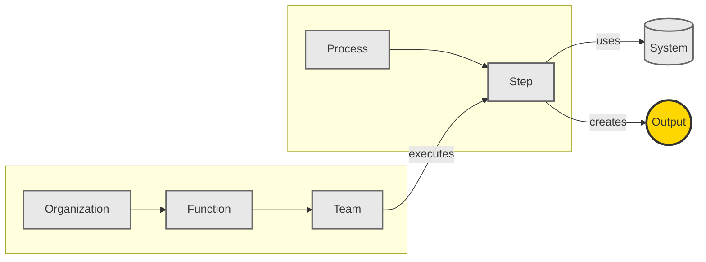
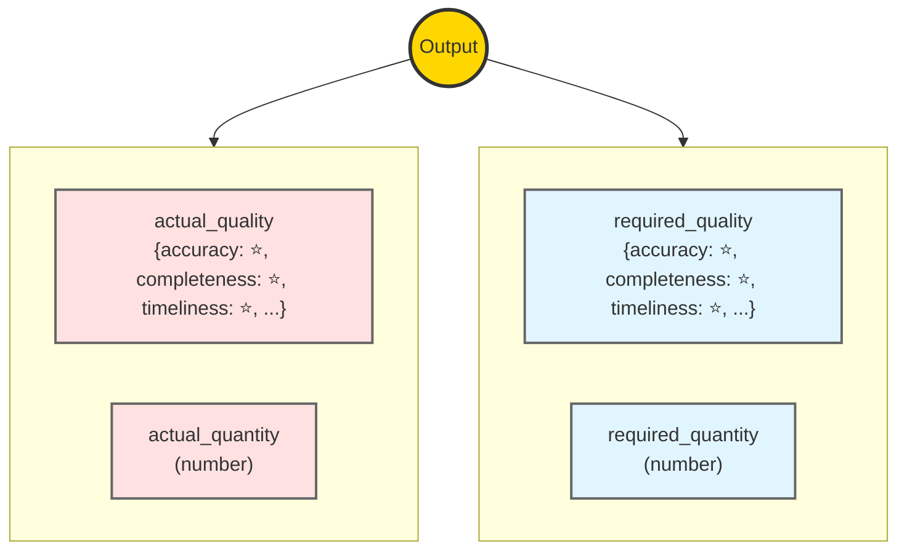
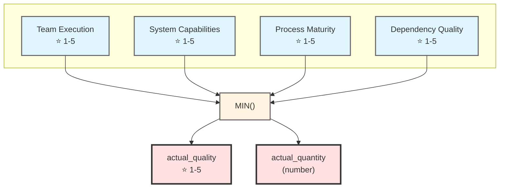
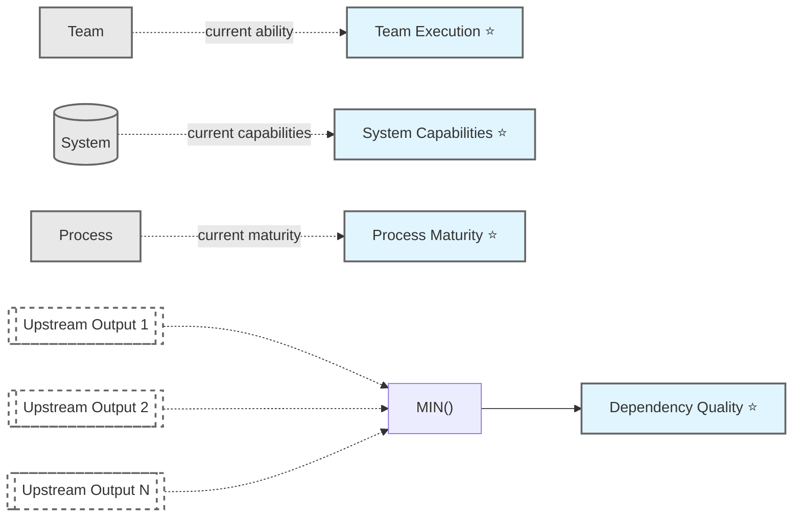
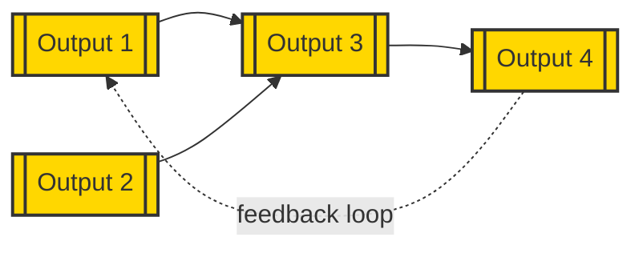
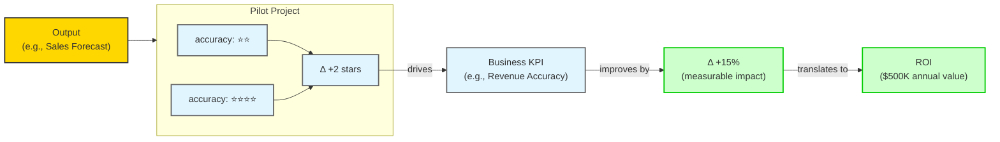
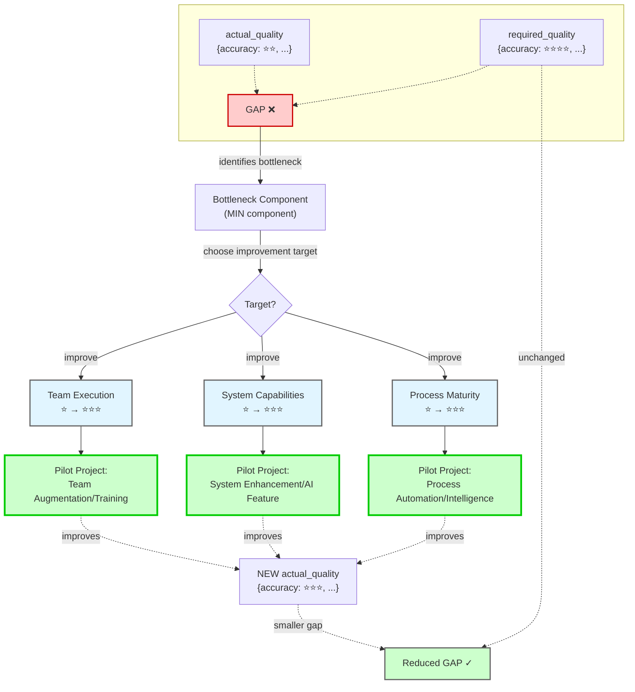

# Domain Model

## Summary

An **Output** (e.g., "Sales Forecast in CRM") is created when a **Team** executes a **Step** in a **Process** using a **System**. Each output has **actual** and **required** quality metrics (named, rated ⭐ 1-5) and quantity.

Actual quality is determined by the **weakest link (MIN)** of four components: Team Execution, System Capabilities, Process Maturity, and Dependency Quality (from upstream outputs).

The **gap** between actual and required quality identifies improvement opportunities. A **Pilot Project** targets one component (Team, System, or Process) to close this gap. This assessment system exists to recommend the right pilot for the right output.

---

## 1. Output Creation Context

**An Output is created when a Team executes a Step in a Process using a System**



---

## 2. Output Properties

**Each Output has actual and required quality metrics (named) and quantity**

Quality metrics use a **1-5 star rating system** rather than precise percentages because organizational assessments are inherently estimates, not measurements. The star system prevents false precision and reflects the reality that users are making informed judgments, not calculating exact values.



---

## 3. Actual Properties Calculation (MIN of 4 Components)

**actual_quality = MIN(Team Execution, System Capabilities, Process Maturity, Dependency Quality)**

The **MIN() function** reflects the "weakest link" reality: excellent inputs processed by a great team through a broken process still produces poor output. This approach forces users to think in terms of "good enough" rather than "perfect"—if three components are ⭐⭐⭐⭐⭐ but one is ⭐⭐, improving the weak component yields immediate results, while optimizing the strong ones has zero impact. It naturally highlights bottlenecks and prevents wasted effort on non-limiting factors.



---

## 4. Component Sources

**Where each component value comes from**



---

## 5. Dependency Graph

**Outputs can depend on upstream outputs (loops allowed, 2-3 hop traversal limit)**



---

## 6. Business Impact & ROI

**Output quality improvements drive measurable business outcomes**



**ROI Calculation:**
- Each output is linked to one or more **Business KPIs** (e.g., Revenue Accuracy, Customer Satisfaction, Operational Cost)
- Each quality metric improvement (Δ stars) has an estimated **impact multiplier** on the KPI (e.g., +1 star in forecast accuracy → +7.5% revenue accuracy)
- KPI improvements translate to **dollar value** based on business context (e.g., +15% revenue accuracy → $500K annual value)

**Example:**
```
Output: "Sales Forecast in CRM"
Metric: accuracy ⭐⭐ → ⭐⭐⭐⭐ (Δ +2 stars)
KPI: Revenue Forecast Accuracy
Impact: +2 stars × 7.5% per star = +15% accuracy improvement
ROI: 15% × $3.3M annual revenue impact = $500K value
```

---

## 7. Pilot Projects: Closing the Gap

**A Pilot Project improves a component to reduce the gap between actual and required output properties**



## Entity Descriptions

### Central Entity: Output
**An Output** is the central concept in the domain model. It represents a specific deliverable or result.

**Properties:**
- `actual_quality` (dict): Named quality metrics, each rated ⭐ 1-5
  - Example: `{accuracy: ⭐⭐⭐, completeness: ⭐⭐, timeliness: ⭐⭐⭐⭐}`
- `actual_quantity` (number): Current volume/throughput of the output
- `required_quality` (dict): Target quality metrics, each rated ⭐ 1-5
  - Example: `{accuracy: ⭐⭐⭐⭐, completeness: ⭐⭐⭐⭐, timeliness: ⭐⭐⭐⭐}`
- `required_quantity` (number): Target volume/throughput needed

**Note:** Quality metric names are specific to each output type (e.g., Sales Forecast might have `accuracy`, `completeness`, `timeliness`; Customer Support Ticket might have `resolution_quality`, `response_time`, `customer_satisfaction`).

### Creation Context
An Output is **created** when:
- A **Team** (part of a **Function**, part of an **Organization**)
- **Executes** a **Step** (part of a **Process**)
- **In/using** a **System**

### Actual Properties Determination
Each quality metric in `actual_quality` is determined by the **MIN (weakest link)** of four components:

1. **Team Execution Ability** (⭐ 1-5): Current capability of the team to execute
2. **System Capabilities** (⭐ 1-5): Current capabilities provided by the system
3. **Process Maturity** (⭐ 1-5): Current maturity level of the process
4. **Dependency Quality** (⭐ 1-5): MIN quality of all upstream outputs this output depends on

**Formula:**
```
For each quality metric (e.g., accuracy):
  Output.actual_quality[metric] = MIN(
    Team.execution_ability,
    System.capabilities,
    Process.maturity,
    MIN(upstream_outputs.actual_quality[metric])
  )
```

### Dependencies
- An Output can **depend on** any number of **Upstream Outputs**
- Dependencies can form loops (organizational feedback cycles)
- Dependency traversal is limited to 2-3 hops for practical assessment

### Pilot Project (GOAL of the System)
**A Pilot Project** is an improvement initiative that targets one of the three improvable components:

**Purpose:** Reduce the gap between `actual_quality` and `required_quality` (and/or quantity)

**Improvement Targets:**
1. **Team Execution** → Pilot types: Team Augmentation, Training, AI Copilots
2. **System Capabilities** → Pilot types: System Enhancement, AI Features, Intelligent Automation
3. **Process Maturity** → Pilot types: Process Automation, Process Intelligence, Workflow Optimization

**Note:** Dependency Quality is improved indirectly by improving upstream outputs.

**Selection Logic:**
1. Identify the gap between actual and required properties
2. Find the bottleneck component (the MIN component limiting actual quality)
3. Select a Pilot Project that improves that component
4. After improvement, actual quality increases (limited by the next-lowest component)