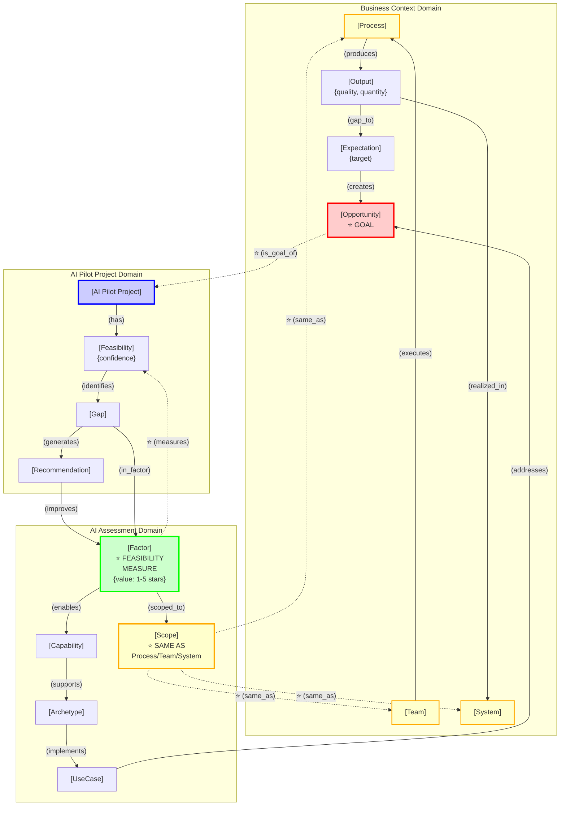
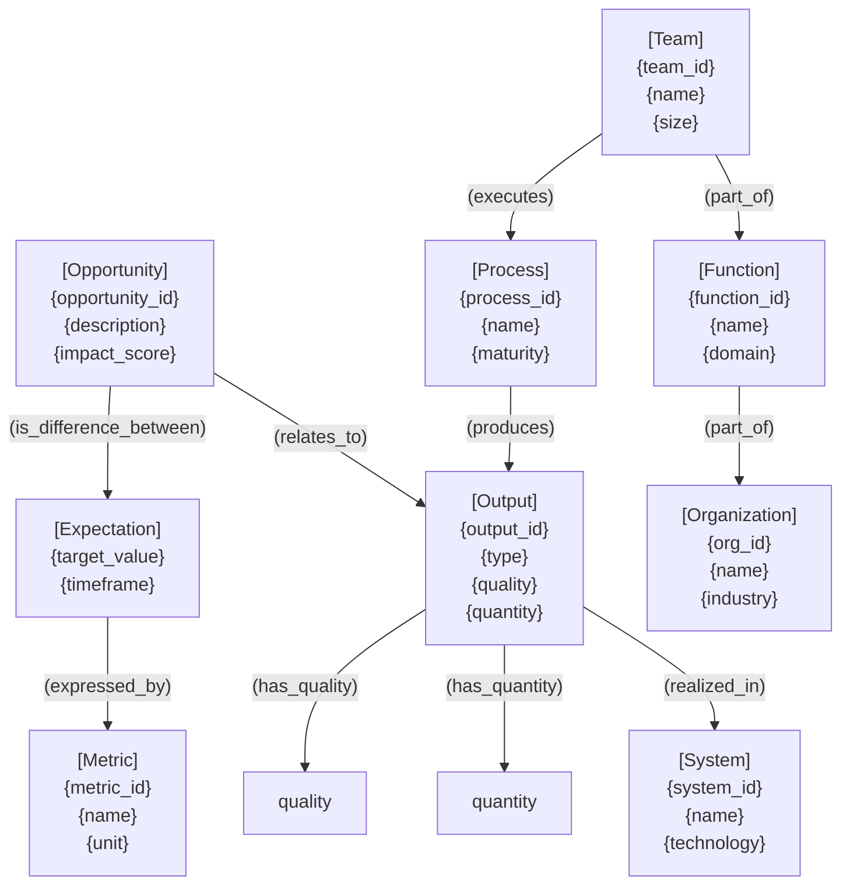
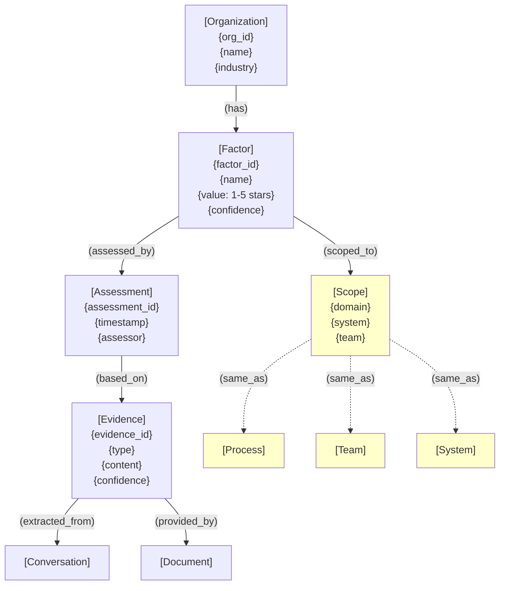
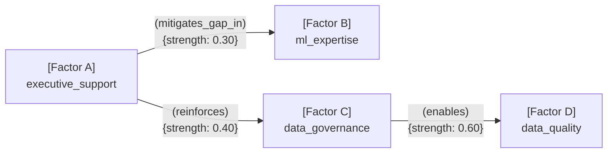
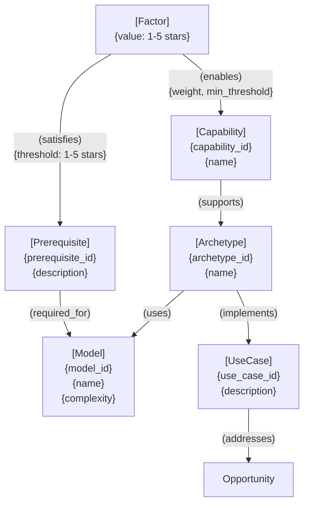
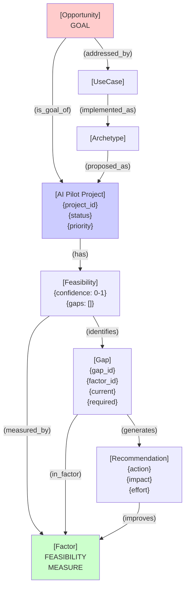
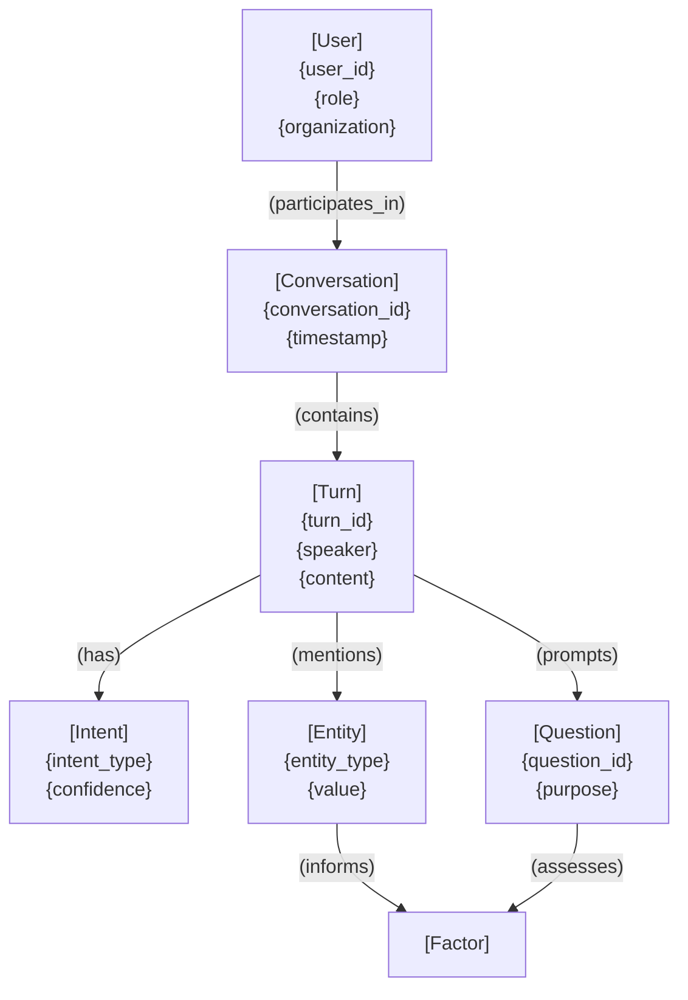

# Entity Relationship Model

**Version:** 1.2  
**Date:** 2025-11-01  
**Last Updated:** 2025-11-01 21:40  
**Purpose:** Canonical reference for all entity types and their relationships in the AI Pilot Assessment Engine

**⚠️ IMPORTANT:** This document describes the scoped factor model. See `output_centric_factor_model_exploration.md` (v0.3) for the evolved output-centric approach.

**Critical Cross-Domain Relationships:**
- Factor Scope = Process/Team/System context (same organizational unit)
- Opportunity = Goal of AI Pilot Project
- Factors = Feasibility measures for AI Pilot success (rated 1-5 stars)

---

## Cross-Domain Integration Overview

This diagram shows how the three critical relationships connect business context, AI assessment, and project feasibility:



**Key Insights:**

1. **Scope = Business Context**: When you assess a Factor (e.g., `data_quality`) for a specific Scope, you're assessing it in the context of the actual Process/Team/System where the Output is produced.

2. **Opportunity = AI Pilot Goal**: The business Opportunity (gap between Expectation and Output) defines WHY the AI Pilot exists. It's the target outcome.

3. **Factors = Feasibility Measures**: Factors assess whether the organization can successfully execute the AI Pilot to achieve the Opportunity. They measure readiness, not the problem itself.

**Example Flow:**
```
Sales Team executes Sales Forecasting Process in CRM System
  → produces Sales Forecast Output (low quality)
  → gap to Expectation (accurate forecasts)
  → creates Opportunity "Improve forecast accuracy"
  
AI Pilot Project has goal: "Improve forecast accuracy"
  → Feasibility measured by Factors:
     - data_quality (scoped to: Sales Team, CRM System, Sales Process) = ⭐⭐⭐ (3 stars)
     - ml_expertise (scoped to: Sales Team) = ⭐⭐ (2 stars)
     - executive_support (scoped to: Sales Function) = ⭐⭐⭐⭐ (4 stars)
  → Feasibility = Moderate → Identifies Gaps → Generates Recommendations
```

---

## Notation Guide

### Relationship Types
- `(verb)` - Relationship/edge between entities
- `[Entity]` - Node/entity type
- `{attribute}` - Property of an entity
- `→` - Directional relationship
- `↔` - Bidirectional relationship

### Cardinality
- `1:1` - One-to-one
- `1:N` - One-to-many
- `N:M` - Many-to-many

---

## Core Business Context Model

### Opportunity Discovery Domain



**Textual Representation:**

```
[Opportunity] (is_difference_between) [Expectation] AND [Output]
  ├─ [Expectation] (expressed_by) [Metric]
  └─ [Output] (has_quality) {quality}
             (has_quantity) {quantity}
             (realized_in) [System]
             (produced_by) [Process]

[Process] (executed_by) [Team]
         (produces) [Output]

[Team] (part_of) [Function]

[Function] (part_of) [Organization]
```

**Natural Language:**
> An **Opportunity** is a **difference** between an **Expectation** (expressed by a **Metric**) and the **quality** or **quantity** of an **Output**. The **Output** is **realized** in a **System** when a **Team** (that is **part** of a **Function** that is **part** of the **Organization**) **executes** a **Process**.

---

## AI Assessment Domain Model

### Organizational Readiness



**Textual Representation:**

```
[Organization] (has) [Factor] {value: 1-5 stars, confidence}
  └─ [Factor] (scoped_to) [Scope] {domain, system, team}
             (assessed_by) [Assessment]
             (influences) [Factor] {strength: 1-5 stars, type}
             (satisfies) [Prerequisite] {threshold: 1-5 stars}
             (enables) [Capability] {weight, importance}

[Scope] (same_as) [Process] | [Team] | [System]
  ⚠️  CRITICAL: Scope is not a separate entity—it references the actual
      organizational unit (Process/Team/System) where the Output is produced.
      When assessing a Factor for a specific Scope, you're assessing it in
      the context of that Process/Team/System.

[Assessment] (based_on) [Evidence] {confidence, type}
  └─ [Evidence] (extracted_from) [Conversation]
                (provided_by) [Document]
```

### Factor Interdependencies



**Relationship Types:**
- `(mitigates_gap_in)` - Source compensates for weakness in target
- `(enables)` - Source is prerequisite for target
- `(reinforces)` - Source amplifies target effectiveness
- `(conflicts_with)` - Source undermines target

---

## AI Capability & Feasibility Model



**Textual Representation:**

```
[Factor] (satisfies) [Prerequisite] {threshold}
        (enables) [Capability] {weight, min_threshold, importance}
        (improves) [Archetype] {impact_score, mechanism}

[Prerequisite] (required_for) [Model]

[Capability] (supports) [Archetype] {confidence_calculation}

[Archetype] (uses) [Model]
           (implements) [UseCase]
           (produces) [Output]

[UseCase] (addresses) [Opportunity]
```

---

## Project Lifecycle Model (AI Pilot)



**Textual Representation:**

```
[Opportunity] (is_goal_of) [AI Pilot Project]
             (addressed_by) [UseCase]
  ⚠️  CRITICAL: The Opportunity defines WHY the AI Pilot exists.
      It's the business problem or improvement target.

[UseCase] (implemented_as) [Archetype]

[Archetype] (proposed_as) [AI Pilot Project] {status, priority, timeline}

[AI Pilot Project] (has) [Feasibility] {confidence, timestamp}
  └─ [Feasibility] (measured_by) [Factor] {value: 1-5 stars}
                  (identifies) [Gap] {factor_id, current, required, delta}
                  (calculates_from) [Factor] + [Capability]
  ⚠️  CRITICAL: Factors are the FEASIBILITY MEASURES for the AI Pilot.
      They determine whether the project can succeed.
      Factor values use 1-5 star ratings (not percentages).

[Gap] (in_factor) [Factor]
     (generates) [Recommendation] {action, impact, effort, roi}

[Recommendation] (improves) [Factor]
                (closes) [Gap]
```

---

## Conversation & Assessment Flow



**Textual Representation:**

```
[User] (participates_in) [Conversation] {timestamp, status}

[Conversation] (contains) [Turn] {sequence, speaker, content}
              (assesses) [Factor]
              (explores) [Opportunity]

[Turn] (has) [Intent] {type, confidence}
      (mentions) [Entity] {type, value, confidence}
      (prompts) [Question] {purpose, factor_target}

[Entity] (informs) [Factor] {contribution, confidence}

[Question] (assesses) [Factor]
          (clarifies) [Scope]
```

---

## Complete Entity Type Catalog

### Business Context Entities

| Entity | Description | Key Attributes | Relationships |
|--------|-------------|----------------|---------------|
| `[Organization]` | The company/entity being assessed | org_id, name, industry, size | (has) Factor, (contains) Function |
| `[Function]` | Business function/department | function_id, name, domain | (part_of) Organization, (contains) Team |
| `[Team]` | Working group within function | team_id, name, size, skills | (part_of) Function, (executes) Process |
| `[Process]` | Business process/workflow | process_id, name, maturity | (executed_by) Team, (produces) Output |
| `[System]` | Technical system/application | system_id, name, technology | (realizes) Output, (used_by) Team |
| `[Output]` | Work product/deliverable | output_id, type, quality, quantity | (produced_by) Process, (realized_in) System |
| `[Metric]` | Measurement/KPI | metric_id, name, unit, target | (measures) Output, (expresses) Expectation |
| `[Expectation]` | Desired state/target | target_value, timeframe | (expressed_by) Metric |
| `[Opportunity]` | Gap/improvement area, **GOAL of AI Pilot** | opportunity_id, description, impact | (is_difference_between) Expectation & Output, (is_goal_of) Project |

### AI Assessment Entities

| Entity | Description | Key Attributes | Relationships |
|--------|-------------|----------------|---------------|
| `[Factor]` | Organizational capability dimension, **FEASIBILITY MEASURE for AI Pilot** | factor_id, name, value (1-5 stars), confidence | (scoped_to) Scope, (satisfies) Prerequisite, (enables) Capability, (measures) Feasibility |
| `[Scope]` | Context for factor assessment (references Process/Team/System) | domain, system, team | (same_as) Process/Team/System, (applies_to) Factor |
| `[Assessment]` | Factor evaluation instance | assessment_id, timestamp, assessor | (assesses) Factor, (based_on) Evidence |
| `[Evidence]` | Supporting information | evidence_id, type, content, confidence | (supports) Assessment, (extracted_from) Conversation |
| `[Prerequisite]` | Technical requirement | prerequisite_id, description, category | (required_for) Model, (satisfied_by) Factor |
| `[Capability]` | AI project capability cluster | capability_id, name, description | (enabled_by) Factor, (supports) Archetype |
| `[Archetype]` | AI use case pattern | archetype_id, name, technical_family | (supported_by) Capability, (uses) Model, (implements) UseCase |
| `[Model]` | ML model/algorithm | model_id, name, complexity | (used_by) Archetype, (requires) Prerequisite |
| `[UseCase]` | Specific AI application | use_case_id, description, domain | (implements) Archetype, (addresses) Opportunity |

### Project & Recommendation Entities

| Entity | Description | Key Attributes | Relationships |
|--------|-------------|----------------|---------------|
| `[AI Pilot Project]` | Proposed AI initiative to achieve Opportunity | project_id, name, status, priority | (has_goal) Opportunity, (implements) UseCase, (has) Feasibility |
| `[Feasibility]` | Project viability assessment | confidence (0-1), gaps[], timestamp | (evaluates) Project, (identifies) Gap |
| `[Gap]` | Capability shortfall | gap_id, factor_id, current, required, delta | (identified_in) Feasibility, (generates) Recommendation |
| `[Recommendation]` | Improvement action | action, impact, effort, roi | (closes) Gap, (improves) Factor |

### Conversation Entities

| Entity | Description | Key Attributes | Relationships |
|--------|-------------|----------------|---------------|
| `[User]` | Person using the system | user_id, role, organization | (participates_in) Conversation |
| `[Conversation]` | Assessment session | conversation_id, timestamp, status | (contains) Turn, (assesses) Factor |
| `[Turn]` | Single exchange | turn_id, speaker, content, sequence | (part_of) Conversation, (has) Intent |
| `[Intent]` | Detected user intention | intent_type, confidence | (detected_in) Turn |
| `[Entity]` | Extracted information | entity_type, value, confidence | (mentioned_in) Turn, (informs) Factor |
| `[Question]` | System query | question_id, purpose, factor_target | (prompted_by) Turn, (assesses) Factor |
| `[Document]` | External artifact | document_id, type, source | (provides) Evidence |

---

## Key Relationship Patterns

### Pattern 1: Opportunity → AI Pilot → Feasibility Flow

```
[Opportunity] (GOAL)
  → (is_goal_of) → [AI Pilot Project]
  → (has) → [Feasibility]
  → (measured_by) → [Factor] (FEASIBILITY MEASURE)
  → (scoped_to) → [Scope]
  → (same_as) → [Process/Team/System] (where Output is produced)
  
Parallel path:
[Opportunity]
  → (addressed_by) → [UseCase] 
  → (implemented_as) → [Archetype] 
  → (requires) → [Capability] 
  → (enabled_by) → [Factor]
```

### Pattern 2: Factor → Feasibility Flow

```
[Factor] 
  → (satisfies) → [Prerequisite] 
  → (required_for) → [Model] 
  → (used_by) → [Archetype] 
  → (evaluated_in) → [Feasibility] 
  → (determines) → [Project Confidence]
```

### Pattern 3: Conversation → Assessment → Feasibility Flow

```
[Turn] 
  → (mentions) → [Entity] 
  → (informs) → [Factor] (scoped to Process/Team/System)
  → (measures) → [Feasibility] (of AI Pilot)
  → (determines) → [Project Confidence]
  
Parallel:
[Factor]
  → (enables) → [Capability] 
  → (supports) → [Archetype] 
  → (implements) → [UseCase] 
  → (addresses) → [Opportunity]
```

### Pattern 4: Gap → Improvement Flow

```
[Feasibility] 
  → (identifies) → [Gap] (in Factor)
  → (generates) → [Recommendation] 
  → (improves) → [Factor] 
  → (increases) → [Capability] 
  → (enables) → [AI Pilot Project]
```

### Pattern 5: Scope Alignment (Cross-Domain Bridge)

```
[Process] (executed_by) [Team] (in) [System]
  → (produces) → [Output]
  → (has_gap_to) → [Expectation]
  → (creates) → [Opportunity] (GOAL)
  
[Factor] (scoped_to) [Scope]
  → (same_as) → [Process/Team/System]
  → (assesses_context_of) → [Output production]
  
⚠️  CRITICAL: When assessing data_quality for "sales forecasting",
    the Scope references the actual Sales Team, CRM System, and
    Sales Process where the forecast Output would be produced.
```

---

## Relationship Cardinalities

### One-to-Many (1:N)

- `[Organization] (contains) [Function]` - One org has many functions
- `[Function] (contains) [Team]` - One function has many teams
- `[Team] (executes) [Process]` - One team executes many processes
- `[Process] (produces) [Output]` - One process produces many outputs
- `[Conversation] (contains) [Turn]` - One conversation has many turns
- `[Feasibility] (identifies) [Gap]` - One feasibility identifies many gaps

### Many-to-Many (N:M)

- `[Factor] (enables) [Capability]` - Factors enable multiple capabilities, capabilities require multiple factors
- `[Capability] (supports) [Archetype]` - Capabilities support multiple archetypes, archetypes need multiple capabilities
- `[Prerequisite] (required_for) [Model]` - Prerequisites required by multiple models, models need multiple prerequisites
- `[Archetype] (implements) [UseCase]` - Archetypes implement multiple use cases, use cases can use multiple archetypes
- `[UseCase] (addresses) [Opportunity]` - Use cases address multiple opportunities, opportunities can be addressed by multiple use cases

### One-to-One (1:1)

- `[Project] (has) [Feasibility]` - One project has one feasibility assessment (at a point in time)
- `[Assessment] (assesses) [Factor]` - One assessment evaluates one factor (scoped)

---

## Implementation Notes

### For Knowledge Graph Construction

1. **Nodes**: All `[Entity]` types become nodes with properties `{attributes}`
2. **Edges**: All `(relationships)` become directed edges with properties `{strength, confidence, etc.}`
3. **Namespacing**: Use prefixes (e.g., `factor:data_quality`, `archetype:classification`)
4. **Versioning**: Include `{version, last_updated}` on all entities

### For LLM Reasoning

1. **Natural Language Templates**: Each relationship has a template
   - Example: `"[Factor A] mitigates gaps in [Factor B] with strength {X} because {reason}"`
2. **Inference Hints**: Relationships include conversation signals
   - Example: `"If user mentions 'CTO backing' + 'low skills' → infer executive_support mitigates ml_expertise"`
3. **Reasoning Chains**: Follow relationship paths for multi-hop reasoning
   - Example: `Factor → Capability → Archetype → UseCase → Opportunity`

### For Human Documentation

1. **Mermaid Diagrams**: Visual representation for each domain
2. **Textual Trees**: Hierarchical view of relationships
3. **Natural Language**: Plain English explanation of each pattern
4. **Entity Catalog**: Reference table with all types and relationships

---

## Validation Rules

### Structural Integrity

- ✅ All entity references must resolve to defined entity types
- ✅ All relationship types must be in allowed set
- ✅ Cardinality constraints must be enforced
- ✅ Circular dependencies must be documented or prevented

### Semantic Consistency

- ✅ Relationship directions must be logical
- ✅ Attribute types must match entity definitions
- ✅ Strength/confidence values must be in valid ranges (1-5 stars for factors, 0-1 for confidence)
- ✅ Natural language descriptions must match formal relationships

### Completeness

- ✅ All entity types must have at least one relationship
- ✅ All relationships must have inverse (if bidirectional)
- ✅ All critical paths must be traversable
- ✅ All domains must connect to core business context

---

## Extension Guidelines

When adding new entity types or relationships:

1. **Define Entity**: Add to catalog with attributes and description
2. **Specify Relationships**: Define all incoming/outgoing edges
3. **Add to Diagram**: Update relevant Mermaid diagram
4. **Document Pattern**: Show how it fits in relationship flows
5. **Validate**: Ensure structural and semantic consistency
6. **Update Cardinality**: Document 1:1, 1:N, or N:M relationships

---

**Status:** v1.2 - Updated for 1-5 star factor system  
**Next Steps:** 
- Align with output-centric factor model (see `output_centric_factor_model_exploration.md`)
- Review factor calculation logic (MIN approach vs weighted average)
- Validate against existing taxonomies, implement in knowledge graph schema
