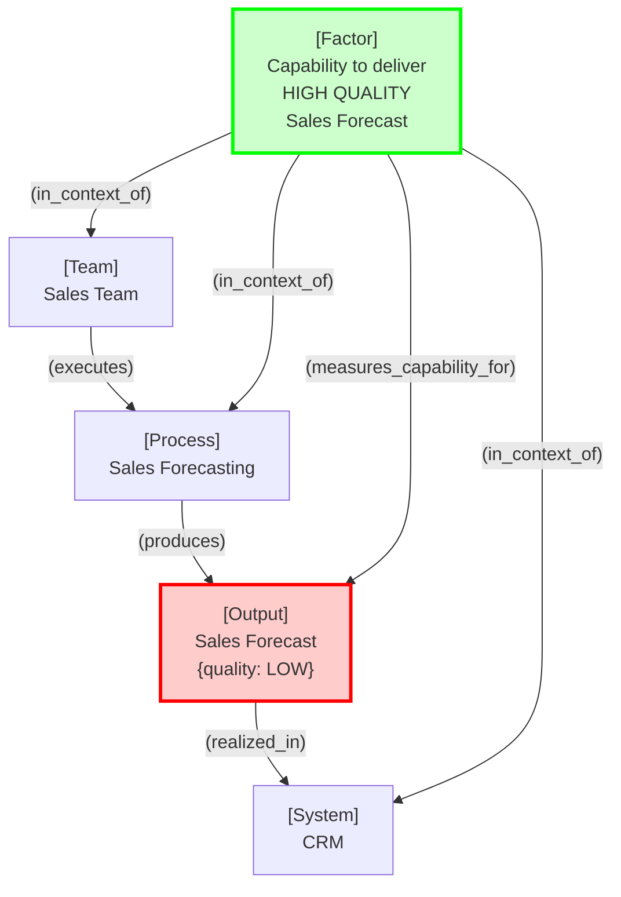

# Output-Centric Factor Model - Design Exploration

**Version:** 0.3 (Scope Locked)  
**Date:** 2025-11-01  
**Last Updated:** 2025-11-01 21:25  
**Purpose:** Explore reconceptualizing Factors as "capability to deliver specific outputs" with output dependencies

**Status:** Scope locked, complexity constraints applied, ready for implementation

---

## Core Concept Shift

**Current Model:**
- Factor = General organizational capability (e.g., "data_quality" = 65)
- Assessed at organization level, optionally scoped to domain/system/team
- Abstract and context-free

**New Model:**
- Factor = Capability to deliver a VERY specific output (e.g., "capability to maintain high data quality of Sales Forecast output in CRM System during Sales Forecasting Process by Sales Team")
- Assessed in context of specific Output + Team + Process + System
- Concrete and actionable

**Key Innovation:**
- Output dependencies enable root cause tracing
- Same capability assessed differently in different contexts
- Diagnostic questions become specific: "What's preventing [Team X] from maintaining high [Output Y] quality in [System Z] during [Process P]?"

---

## Diagram 1: Output-Centric Factor Model



**Key Change:** Factor is now explicitly tied to a specific Output, not a general capability dimension.

---

## Diagram 2: Output Dependencies Enable Smart Questions

```mermaid
graph TD
    subgraph Upstream
        TeamA["[Team A]<br/>Data Engineering"]
        ProcessA["[Process A]<br/>Data Pipeline"]
        SystemA["[System A]<br/>Data Warehouse"]
        OutputA["[Output A]<br/>Clean Customer Data<br/>{quality: MEDIUM}"]
        
        FactorA["[Factor A]<br/>Capability to deliver<br/>HIGH QUALITY<br/>Clean Customer Data"]
        
        TeamA -->|"(executes)"| ProcessA
        ProcessA -->|"(produces)"| OutputA
        OutputA -->|"(realized_in)"| SystemA
        FactorA -->|"(measures)"| OutputA
    end
    
    subgraph Downstream
        TeamB["[Team B]<br/>Sales Team"]
        ProcessB["[Process B]<br/>Sales Forecasting"]
        SystemB["[System B]<br/>CRM"]
        OutputB["[Output B]<br/>Sales Forecast<br/>{quality: LOW}"]
        
        FactorB["[Factor B]<br/>Capability to deliver<br/>HIGH QUALITY<br/>Sales Forecast"]
        
        TeamB -->|"(executes)"| ProcessB
        ProcessB -->|"(produces)"| OutputB
        OutputB -->|"(realized_in)"| SystemB
        FactorB -->|"(measures)"| OutputB
    end
    
    OutputA -.->|"⭐ (dependency)<br/>RELIES ON"| OutputB
    ProcessB -.->|"(consumes)"| OutputA
    
    style OutputA fill:#ffffcc,stroke:#ffaa00,stroke-width:3px
    style OutputB fill:#ffcccc,stroke:#ff0000,stroke-width:3px
    style FactorA fill:#ccffcc,stroke:#00ff00,stroke-width:2px
    style FactorB fill:#ccffcc,stroke:#00ff00,stroke-width:3px
```



**Smart Question Enabled:**
> "What's preventing **Sales Team** from maintaining high **Sales Forecast** quality in **CRM** during **Sales Forecasting Process**?"

**Diagnostic Options:**
1. Is it **Output A** (Clean Customer Data) that this process relies on?
2. Is it **Sales Team** failing at execution?
3. Is the **CRM System** making it hard?
4. Is the **Sales Forecasting Process** itself flawed?

---

## Design Decisions Summary

Based on exploration and analysis, the following design decisions have been made:

### ✅ 1. Output Granularity (RESOLVED)
**Decision:** Support flexible, hierarchical output specificity driven by user needs.

**Rationale:**
- Same data hierarchy handles any specificity level (e.g., "Sales Forecast" vs. "Q4 EMEA Sales Forecast")
- Users can choose to assess APAC and EMEA independently if needed
- Temporal dimension less critical—Q3 capability largely determines Q4 capability
- System should not force granularity, let user drive detail level

**Implementation:**
- Output entity supports hierarchical relationships (parent/child outputs)
- Factor assessment can target any level of hierarchy
- Aggregation rolls up from specific to general

---

### ✅ 2. Dependency Modeling (RESOLVED)
**Decision:** Allow dependency loops, limit traversal to 2-3 hops.

**Rationale:**
- Preventing loops (enforcing DAG) is overly restrictive
- Loops represent organizational feedback loops—valuable insight, not a bug!
- Limiting hops prevents complexity explosion
- 2-3 hops sufficient for practical root cause analysis

**Implementation:**
- Output dependencies stored as directed edges (can form cycles)
- Dependency impact calculation limited to configurable depth (default: 2-3 hops)
- When loop detected during traversal, flag as "positive feedback loop" in diagnostics
- Example: "Data Quality → Process Efficiency → Data Quality" = virtuous/vicious cycle

---

### ✅ 3. Scalability Limits (RESOLVED)
**Decision:** Implement configurable limits with sensible defaults.

**Limits:**
- **Max dependency depth:** 2-3 hops (configurable)
- **Max dependencies per output:** 10 (configurable)
- **Max outputs in assessment scope:** 50 (configurable)

**Rationale:**
- Prevents performance issues with large graphs
- Keeps assessments focused and manageable
- Power users can adjust if needed

**Implementation:**
- Configuration file with limit parameters
- System warns when approaching limits
- Graceful degradation (truncate, don't fail)

---

### ✅ 4. Organizational Aggregation (RESOLVED)
**Decision:** Output-specific factors aggregate to reveal organizational patterns.

**Insight:** 
- Low-quality output in one context implies broader issues
- Example: Multiple low-quality data outputs → Function has low data standards
- CxO-level factors valid as output-specific (e.g., "capability to fund AI projects")

**Aggregation Patterns:**
- **Function-level:** "Sales function has low data quality across all outputs"
- **Organization-level:** "Company-wide low executive support for AI initiatives"
- **Domain-level:** "Finance domain has high process maturity"
- **Archetype-level:** "Organization struggles with forecasting outputs generally"

**Implementation:**
- Factor values can be aggregated by Team, Function, Domain, Output Type
- Aggregation reveals patterns: "5 out of 7 forecasting outputs have low quality"
- System can suggest: "Consider function-wide data quality initiative"

---

### ✅ 5. Factor Scoring System (RESOLVED)
**Decision:** Use 1-5 star rating system for all factor assessments.

**Rationale:**
- All factor values are rough estimations—the representation should reflect that
- Prevents false precision ("65 vs 70" is meaningless)
- Standardized across entire system—simpler to understand and communicate
- Makes factor calculation more straightforward (no complex weighted averages)
- Reduces cognitive load on users during assessment
- Industry-standard pattern (everyone understands star ratings)

**Scale Definition:**
- ⭐ (1 star): Critical issues, major blockers, fundamentally broken
- ⭐⭐ (2 stars): Significant problems, frequent failures, needs major work
- ⭐⭐⭐ (3 stars): Functional but inconsistent, room for improvement
- ⭐⭐⭐⭐ (4 stars): Good quality, minor issues, mostly reliable
- ⭐⭐⭐⭐⭐ (5 stars): Excellent, consistent, best-in-class

**Implementation:**
- All factors stored as 1-5 integer values
- UI displays as star ratings
- Conversation uses natural language that maps to stars
- No decimal values, no percentages, no 0-100 scales

---

### ✅ 6. Factor Calculation Logic (RESOLVED)
**Decision:** Factor value = "as good as the worst contributing factor" (minimum of components).

**Rationale:**
- Reflects reality: Good inputs + good engineers + bad QA = still bad output
- Chain is only as strong as weakest link
- Arbitrary calculation is honest—we're estimating, not measuring precisely
- Simpler than weighted averages
- Highlights bottlenecks clearly
- Prevents masking critical issues with high averages

**Formula:**
```
Output_Factor = MIN(Dependency_Quality, Team_Execution, Process_Maturity, System_Support)
```

**Example:**
- Dependency Quality: ⭐⭐⭐⭐ (4 stars)
- Team Execution: ⭐⭐⭐ (3 stars)  
- Process Maturity: ⭐⭐ (2 stars)
- System Support: ⭐⭐⭐⭐⭐ (5 stars)
- **Result: ⭐⭐ (2 stars)** ← Process Maturity is the bottleneck

**Implementation:**
- Calculate factor as MIN() of all components
- Display bottleneck component prominently
- Recommendation focuses on improving the weakest link

---

### 🔄 7. Factor Calculation Weights (DEPRECATED)
**Status:** Superseded by Decision #6 (MIN-based calculation)

**Original Question:** How to weight sub-factors (Dependency Quality, Team Execution, Process Maturity, System Support)?

**Resolution:** Weighted averages abandoned in favor of MIN() approach. Simpler, more honest about estimation nature, highlights bottlenecks clearly.

**See:** Decision #6 for current approach

---

### 🔄 8. Conversation Design (TBD)
**Question:** How to naturally elicit output-specific information in conversation?

**Key Challenges:**
- Identifying target output without interrogation
- Discovering Team/Process/System context naturally
- Assessing factor components conversationally
- Tracing dependencies without overwhelming user

**Approaches to Explore:**
- **Problem-first:** "What's not working?" → identify output
- **Output-first:** "What do you produce?" → assess capability
- **Team-first:** "Tell me about your team" → discover outputs
- **System-first:** "What systems do you use?" → find outputs
- **Opportunity-first:** "What do you want to improve?" → trace to output

**Next Steps:**
- Prototype 3-5 conversation flows
- Test with real users
- Measure completion rate and satisfaction

**See:** TBD #10 for full context

---

## Diagram 3: Multi-Level Dependency Chain

```mermaid
graph TD
    O1["[Output 1]<br/>Raw Transaction Logs<br/>{quality: ⭐⭐⭐⭐}"]
    F1["[Factor 1]<br/>Capability: Raw Logs"]
    
    O2["[Output 2]<br/>Clean Customer Data<br/>{quality: ⭐⭐⭐}"]
    F2["[Factor 2]<br/>Capability: Clean Data"]
    
    O3["[Output 3]<br/>Sales Forecast<br/>{quality: ⭐⭐}"]
    F3["[Factor 3]<br/>Capability: Forecast"]
    
    O1 -.->|"(dependency)"| O2
    O2 -.->|"(dependency)"| O3
    
    F1 -->|"(measures)"| O1
    F2 -->|"(measures)"| O2
    F3 -->|"(measures)"| O3
    
    Question["❓ Why is Sales Forecast quality LOW?"]
    
    Question -.-> A1["Option A:<br/>O2 quality is MEDIUM (⭐⭐⭐)<br/>→ Upstream problem"]
    Question -.-> A2["Option B:<br/>O2 quality is OK (⭐⭐⭐)<br/>but Team/Process/System<br/>can't convert it<br/>→ Execution problem"]
    
    style O3 fill:#ffcccc,stroke:#ff0000,stroke-width:3px
    style O2 fill:#ffffcc,stroke:#ffaa00,stroke-width:2px
    style O1 fill:#ccffcc,stroke:#00ff00,stroke-width:2px
```



**Diagnostic Logic:**
1. Check **Factor 3** (capability to produce O3)
2. If low → Check dependencies:
   - Is **Output 2** quality sufficient? (Check Factor 2)
   - If O2 is good → Problem is in Team/Process/System for O3
   - If O2 is bad → Recurse to **Output 1** (Check Factor 1)

---

## Diagram 4: Factor Decomposition with Root Cause Analysis

```mermaid
graph TD
    Output["[Output]<br/>Sales Forecast<br/>{quality: LOW}"]
    
    Factor["[Factor]<br/>Capability to deliver<br/>HIGH QUALITY Sales Forecast"]
    
    Factor --> Q1["❓ Root Cause?"]
    
    Q1 --> Dependency["1. Dependency Issue<br/>(Upstream Output)"]
    Q1 --> Execution["2. Execution Issue<br/>(Team Capability)"]
    Q1 --> Process_Issue["3. Process Issue<br/>(Process Design)"]
    Q1 --> System_Issue["4. System Issue<br/>(System Limitations)"]
    
    Dependency --> UpstreamOutput["Check:<br/>[Output A] quality<br/>that this relies on"]
    
    Execution --> TeamCapability["Check:<br/>- Skills<br/>- Training<br/>- Resources<br/>- Motivation"]
    
    Process_Issue --> ProcessMaturity["Check:<br/>- Documentation<br/>- Standardization<br/>- Optimization"]
    
    System_Issue --> SystemCapability["Check:<br/>- Features<br/>- Performance<br/>- Integration<br/>- Usability"]
    
    style Factor fill:#ccffcc,stroke:#00ff00,stroke-width:3px
    style Output fill:#ffcccc,stroke:#ff0000,stroke-width:3px
    style Dependency fill:#ffffcc,stroke:#ffaa00,stroke-width:2px
```



### 🎯 Connection to AI Pilot Opportunities

**This diagram is the perfect anchor point for identifying AI Pilot opportunities because:**

Each root cause category maps directly to a potential AI intervention:

1. **Dependency Issue (Upstream Output)** → **AI Pilot Opportunity: Data Quality/Pipeline Automation**
   - If upstream output quality is the bottleneck, AI can help with data cleaning, validation, or pipeline optimization
   - Example: "Automate data quality checks for Clean Customer Data"

2. **Execution Issue (Team Capability)** → **AI Pilot Opportunity: Augmentation/Automation**
   - If team lacks skills/resources, AI can augment their capabilities or automate tasks
   - Example: "Deploy AutoML for sales forecasting to reduce ML expertise requirement"

3. **Process Issue (Process Design)** → **AI Pilot Opportunity: Process Intelligence/Optimization**
   - If process is inefficient, AI can optimize workflows or provide process insights
   - Example: "Use process mining to identify forecasting workflow bottlenecks"

4. **System Issue (System Limitations)** → **AI Pilot Opportunity: Intelligent Features/Integration**
   - If system lacks capabilities, AI can add intelligent features
   - Example: "Add ML-powered forecasting module to CRM"

**The Assessment Flow:**
```
Low Output Quality (Opportunity exists)
  → Factor Decomposition (Diagram 4)
  → Identify Root Cause Category
  → Map to AI Pilot Archetype
  → Assess Feasibility with Output-Centric Factors
  → Propose AI Pilot Project
```

**Example:**
- **Output:** Sales Forecast (quality: LOW)
- **Root Cause:** Execution Issue (Team lacks ML expertise)
- **AI Opportunity:** "Automate sales forecasting with AutoML"
- **Feasibility Check:** Assess "capability to deploy AutoML forecasting" using factors:
  - Data availability (for training)
  - Data quality (of inputs)
  - System integration capability
  - Change management readiness

---

## Diagram 5: Conversation Flow with Output-Centric Factors

```mermaid
graph TD
    Start["User: 'We need better<br/>sales forecasts'"]
    
    Start --> Identify["System identifies:<br/>[Output] = Sales Forecast<br/>[Team] = Sales Team<br/>[Process] = Forecasting<br/>[System] = CRM"]
    
    Identify --> AssessFactor["Assess [Factor]:<br/>Capability to deliver<br/>high-quality Sales Forecast"]
    
    AssessFactor --> Low["Factor = 35<br/>(LOW)"]
    
    Low --> RootCause["❓ Root Cause Analysis"]
    
    RootCause --> Q1["Q1: What upstream outputs<br/>does Sales Forecast depend on?"]
    Q1 --> A1["A1: Clean Customer Data,<br/>Historical Sales Data"]
    
    RootCause --> Q2["Q2: How is the quality of<br/>Clean Customer Data?"]
    Q2 --> A2["A2: Factor = 55 (MEDIUM)<br/>→ Potential bottleneck"]
    
    RootCause --> Q3["Q3: Does Sales Team have<br/>the skills to produce forecasts?"]
    Q3 --> A3["A3: Limited ML expertise<br/>→ Execution gap"]
    
    RootCause --> Q4["Q4: Does CRM System support<br/>forecasting workflows?"]
    Q4 --> A4["A4: No built-in forecasting<br/>→ System limitation"]
    
    A2 --> Recommendation1["Recommendation 1:<br/>Improve Clean Customer Data<br/>(upstream dependency)"]
    A3 --> Recommendation2["Recommendation 2:<br/>Train Sales Team in ML<br/>(execution capability)"]
    A4 --> Recommendation3["Recommendation 3:<br/>Add forecasting module to CRM<br/>(system enhancement)"]
    
    style AssessFactor fill:#ccffcc,stroke:#00ff00,stroke-width:3px
    style Low fill:#ffcccc,stroke:#ff0000,stroke-width:2px
    style A2 fill:#ffffcc,stroke:#ffaa00,stroke-width:2px
```



---

## Diagram 6: Factor Assessment with Context Specificity

```mermaid
graph LR
    subgraph Context_1["Context 1: Sales Forecasting"]
        T1["Sales Team"]
        P1["Forecasting Process"]
        S1["CRM System"]
        O1["Sales Forecast"]
        F1["Factor = 35<br/>(LOW)"]
        
        F1 -.-> O1
    end
    
    subgraph Context_2["Context 2: Inventory Planning"]
        T2["Operations Team"]
        P2["Planning Process"]
        S2["ERP System"]
        O2["Inventory Plan"]
        F2["Factor = 75<br/>(HIGH)"]
        
        F2 -.-> O2
    end
    
    GenericCapability["Generic Capability:<br/>'Forecasting Capability'"]
    
    GenericCapability -.->|"TOO ABSTRACT"| F1
    GenericCapability -.->|"TOO ABSTRACT"| F2
    
    Note["⚠️ Same 'forecasting' capability<br/>but DIFFERENT contexts<br/>→ DIFFERENT factor values"]
    
    style F1 fill:#ffcccc,stroke:#ff0000,stroke-width:2px
    style F2 fill:#ccffcc,stroke:#00ff00,stroke-width:2px
    style GenericCapability fill:#cccccc,stroke:#666666,stroke-width:2px,stroke-dasharray: 5 5
```



**Key Insight:** The same general capability (e.g., "forecasting") manifests differently in different contexts. Output-centric factors capture this specificity.

---

## Diagram 7: Output Dependency Graph for Smart Questioning

```mermaid
graph TD
    O1["[O1] Raw Logs<br/>Quality: 90"]
    O2["[O2] Clean Data<br/>Quality: 70"]
    O3["[O3] Customer Segments<br/>Quality: 65"]
    O4["[O4] Sales Forecast<br/>Quality: 30"]
    O5["[O5] Inventory Plan<br/>Quality: 40"]
    O6["[O6] Marketing Campaign<br/>Quality: 55"]
    
    O1 -->|"(feeds)"| O2
    O2 -->|"(feeds)"| O3
    O2 -->|"(feeds)"| O4
    O3 -->|"(feeds)"| O6
    O4 -->|"(feeds)"| O5
    
    Problem["❗ Problem:<br/>Inventory Plan quality LOW"]
    
    Problem -.-> Trace1["Trace dependency:<br/>O5 ← O4 ← O2 ← O1"]
    
    Trace1 --> Analysis["Analysis:<br/>O1 = 90 ✓<br/>O2 = 70 ⚠️<br/>O4 = 30 ❌<br/>O5 = 40 ❌"]
    
    Analysis --> Insight["Insight:<br/>Bottleneck at O4<br/>(Sales Forecast)<br/>caused by O2<br/>(Clean Data)"]
    
    Insight --> SmartQ["Smart Question:<br/>'What's preventing<br/>Data Engineering Team<br/>from maintaining<br/>high Clean Data quality<br/>in Data Warehouse<br/>during ETL Process?'"]
    
    style O4 fill:#ffcccc,stroke:#ff0000,stroke-width:3px
    style O5 fill:#ffcccc,stroke:#ff0000,stroke-width:3px
    style O2 fill:#ffffcc,stroke:#ffaa00,stroke-width:3px
    style O1 fill:#ccffcc,stroke:#00ff00,stroke-width:2px
```



---

## Diagram 8: Factor as Composite of Sub-Factors

```mermaid
graph TD
    Output["[Output]<br/>Sales Forecast"]
    
    MainFactor["[Main Factor]<br/>Capability to deliver<br/>high-quality Sales Forecast<br/>Value: ⭐⭐ (2 stars)"]
    
    MainFactor --> SF1["[Sub-Factor 1]<br/>Dependency Quality<br/>Value: ⭐⭐⭐ (3 stars)"]
    MainFactor --> SF2["[Sub-Factor 2]<br/>Team Execution<br/>Value: ⭐⭐⭐ (3 stars)"]
    MainFactor --> SF3["[Sub-Factor 3]<br/>Process Maturity<br/>Value: ⭐⭐ (2 stars)"]
    MainFactor --> SF4["[Sub-Factor 4]<br/>System Support<br/>Value: ⭐⭐ (2 stars)"]
    
    SF1 --> UpstreamOutputs["Check quality of:<br/>- Clean Customer Data<br/>- Historical Sales Data"]
    
    SF2 --> TeamCapabilities["Check:<br/>- ML expertise<br/>- Domain knowledge<br/>- Tool proficiency"]
    
    SF3 --> ProcessAttributes["Check:<br/>- Documentation<br/>- Standardization<br/>- Feedback loops"]
    
    SF4 --> SystemFeatures["Check:<br/>- Forecasting tools<br/>- Data access<br/>- Visualization"]
    
    Formula["Formula:<br/>Main Factor = MIN(<br/>  Dependency Quality,<br/>  Team Execution,<br/>  Process Maturity,<br/>  System Support<br/>)<br/><br/>Result: MIN(3, 3, 2, 2) = 2 stars<br/>Bottlenecks: Process + System"]
    
    style MainFactor fill:#ccffcc,stroke:#00ff00,stroke-width:3px
    style SF1 fill:#ffffcc,stroke:#ffaa00,stroke-width:2px
    style SF2 fill:#ffcccc,stroke:#ff0000,stroke-width:2px
    style SF3 fill:#ffcccc,stroke:#ff0000,stroke-width:2px
    style SF4 fill:#ffcccc,stroke:#ff0000,stroke-width:2px
```



---

## Diagram 9: Comparison - Old vs New Model

```mermaid
graph TB
    subgraph Old_Model["OLD MODEL: Abstract Factors"]
        OldOrg["[Organization]"]
        OldFactor1["[Factor]<br/>data_quality = 65"]
        OldFactor2["[Factor]<br/>ml_expertise = 40"]
        OldFactor3["[Factor]<br/>executive_support = 80"]
        
        OldOrg --> OldFactor1
        OldOrg --> OldFactor2
        OldOrg --> OldFactor3
        
        OldQuestion["❓ Question:<br/>'What is your<br/>data quality?'<br/>(TOO VAGUE)"]
    end
    
    subgraph New_Model["NEW MODEL: Output-Centric Factors"]
        NewOutput1["[Output]<br/>Sales Forecast"]
        NewOutput2["[Output]<br/>Clean Customer Data"]
        NewOutput3["[Output]<br/>Inventory Plan"]
        
        NewFactor1["[Factor]<br/>Capability: Sales Forecast<br/>= 35"]
        NewFactor2["[Factor]<br/>Capability: Clean Data<br/>= 55"]
        NewFactor3["[Factor]<br/>Capability: Inventory Plan<br/>= 40"]
        
        NewFactor1 --> NewOutput1
        NewFactor2 --> NewOutput2
        NewFactor3 --> NewOutput3
        
        NewOutput1 -.->|"(depends_on)"| NewOutput2
        NewOutput3 -.->|"(depends_on)"| NewOutput1
        
        NewQuestion["❓ Question:<br/>'What's preventing<br/>Sales Team from maintaining<br/>high Sales Forecast quality<br/>in CRM during<br/>Forecasting Process?'<br/>(SPECIFIC & ACTIONABLE)"]
    end
    
    style Old_Model fill:#ffeeee,stroke:#ff0000,stroke-width:2px
    style New_Model fill:#eeffee,stroke:#00ff00,stroke-width:2px
```



---

## Diagram 10: End-to-End Flow with Output Dependencies

```mermaid
graph TD
    Start["User: 'Improve sales forecasts'"]
    
    Start --> IdentifyOutput["Identify target:<br/>[Output] = Sales Forecast<br/>[Team] = Sales Team<br/>[System] = CRM"]
    
    IdentifyOutput --> AssessFactor["Assess Factor:<br/>Capability to deliver<br/>Sales Forecast<br/>Result: 35 (LOW)"]
    
    AssessFactor --> CheckDeps["Check dependencies:<br/>What outputs does<br/>Sales Forecast rely on?"]
    
    CheckDeps --> FindDeps["Found dependencies:<br/>1. Clean Customer Data<br/>2. Historical Sales Data<br/>3. Market Trends"]
    
    FindDeps --> AssessUpstream["Assess upstream factors:<br/>1. Clean Data capability = 55<br/>2. Historical Data capability = 70<br/>3. Market Trends capability = 45"]
    
    AssessUpstream --> IdentifyBottleneck["Identify bottlenecks:<br/>1. Clean Customer Data (55)<br/>2. Market Trends (45)<br/>→ Both below threshold"]
    
    IdentifyBottleneck --> DecomposeBottleneck["Decompose bottleneck:<br/>Why is Clean Data capability 55?"]
    
    DecomposeBottleneck --> RootCause["Root causes:<br/>1. Data Engineering Team<br/>   lacks resources (40)<br/>2. ETL Process not optimized (50)<br/>3. Data Warehouse has<br/>   performance issues (60)"]
    
    RootCause --> Recommendations["Recommendations:<br/>1. Hire 2 data engineers<br/>   → +15 to Clean Data<br/>2. Optimize ETL Process<br/>   → +10 to Clean Data<br/>3. Upgrade Data Warehouse<br/>   → +5 to Clean Data<br/><br/>Combined impact:<br/>Clean Data: 55 → 85<br/>Sales Forecast: 35 → 60"]
    
    style AssessFactor fill:#ffcccc,stroke:#ff0000,stroke-width:3px
    style IdentifyBottleneck fill:#ffffcc,stroke:#ffaa00,stroke-width:3px
    style Recommendations fill:#ccffcc,stroke:#00ff00,stroke-width:3px
```



---

## Key Benefits of Output-Centric Model

1. **Specificity**: Factors are tied to concrete outputs, not abstract capabilities
2. **Traceability**: Output dependencies enable root cause analysis
3. **Actionability**: Questions are specific to Team/Process/System context
4. **Diagnostic Power**: Can distinguish between upstream vs. execution problems
5. **Granularity**: Can assess same capability in different contexts separately
6. **Smart Questioning**: System can ask "Why is X preventing Y in context Z?"

---

## Open Questions - Answered

### 1. **Granularity** ✅ RESOLVED
**Question:** How specific should outputs be? (e.g., "Sales Forecast" vs. "Q4 2024 Sales Forecast for EMEA Region")

**Answer:** The same data hierarchy can handle any specificity level. Users can choose to consider APAC and EMEA outputs independently if needed. Temporal dimension is less important—Q3 forecast capability will largely determine Q4 forecast capability. The system should support flexible granularity based on user needs.

**Decision:** Support hierarchical output specificity, let user drive the level of detail.

---

### 2. **Dependency Modeling** ✅ RESOLVED
**Question:** How to capture complex dependencies (many-to-many, conditional)?

**Answer:** Keep it minimal to avoid complexity explosion. Two approaches:
- **Option A:** Prevent creation of dependency loops (enforce DAG)
- **Option B:** Allow loops, limit dependency impact calculation to 2-3 hops

If hops land in a loop, we've captured a positive feedback loop in the organization (which is valuable insight!).

**Decision:** Allow loops, limit traversal to 2-3 hops. Loops = organizational feedback loops = feature, not bug.

---

### 3. **Factor Calculation** 🔄 TBD
**Question:** How to weight sub-factors (dependency, execution, process, system)?

**Status:** Complex question requiring deeper exploration.

**Context for Future Work:**
- Factor = composite of: Dependency Quality, Team Execution, Process Maturity, System Support
- Need to determine:
  - Default weights (e.g., 0.35, 0.30, 0.20, 0.15)
  - Whether weights vary by output type or archetype
  - How to learn/adjust weights from real assessments
  - Whether to expose weights to users for customization
- Consider: Different AI archetypes may have different weight profiles
  - Data-heavy projects: Dependency Quality weighted higher
  - Automation projects: System Support weighted higher
  - Augmentation projects: Team Execution weighted higher

**Recommendation:** Start with equal weights (0.25 each), collect data, iterate based on real assessments.

---

### 4. **Conversation Design** 🔄 TBD
**Question:** How to naturally elicit output-specific information?

**Status:** Requires UX/conversation flow design.

**Context for Future Work:**
- Need to design conversation patterns that:
  - Identify the target output naturally ("What are you trying to improve?")
  - Discover Team/Process/System context without interrogation
  - Assess factor components (dependency, execution, process, system) conversationally
  - Trace upstream dependencies without overwhelming user
- Key challenges:
  - Balancing specificity with conversation flow
  - Knowing when to drill down vs. move on
  - Handling ambiguity in output identification
  - Managing multi-output scenarios (user wants to improve 3 things)
- Consider:
  - Progressive disclosure (start broad, get specific)
  - Contextual follow-ups based on detected gaps
  - Visual aids (show output dependency graph to user?)
  - Allow user to skip/defer questions

**Recommendation:** Prototype 3-5 conversation flows with different entry points, test with real users.

---

### 5. **Scalability** ✅ RESOLVED
**Question:** How to manage large output dependency graphs?

**Answer:** Add a configurable limit on:
- Maximum dependency depth to traverse (default: 2-3 hops)
- Maximum number of dependencies per output (default: 10)
- Maximum total outputs in assessment scope (default: 50)

**Decision:** Implement configurable limits with sensible defaults. Allow power users to adjust.

---

### 6. **Generalization** ✅ RESOLVED
**Question:** Can we still provide org-level insights from output-specific factors?

**Answer:** Yes. A very low-quality data process implies that the domain (function) has low standards. It's valid to represent CxO-level factors as "capability to deliver specific output."

**Example:** Low AI/automation drive = low capability of funding AI projects. This is not a value judgment, but an objective observation from the context of one specific output.

**Insight:** Output-specific factors can aggregate to reveal:
- Function-level patterns (Sales function has low data quality across all outputs)
- Organization-level patterns (Company-wide low executive support for AI)
- Domain-level patterns (Finance domain has high process maturity)

**Decision:** Output-centric model supports both granular and aggregated insights. Aggregation reveals organizational patterns.

---

## Implementation Roadmap (Testable Increments)

### Increment 1: Single Output-Centric Factor Assessment
**Goal:** User can assess capability to deliver ONE specific output in conversation

**What Gets Built:**
1. Extend Output entity with: `output_id`, `name`, `current_quality` (0-100), `team_id`, `process_id`, `system_id`
2. Create OutputFactor entity: `factor_id`, `output_id`, `value` (0-100), `confidence`, `timestamp`
3. Add conversation endpoint: `POST /api/conversation/assess-output-factor`
4. Implement LLM prompt that extracts: Output name, Team, Process, System from user input
5. Store assessment in database

**Test Scenario (In Target System):**
```
User Input: "Our sales team struggles to produce accurate forecasts in the CRM system"

System Actions:
1. Extracts: Output="Sales Forecast", Team="Sales Team", Process="Forecasting", System="CRM"
2. Creates Output entity (if not exists)
3. Asks: "How would you rate your team's capability to deliver high-quality sales forecasts? (1-5 stars)"
4. User: "About 2 stars - we struggle significantly"
5. Creates OutputFactor with value=2
6. Stores in database

Verification:
- Query database: SELECT * FROM output_factors WHERE output_id = [sales_forecast_id]
- Confirm: value=2, output linked to team/process/system
- API returns: {"output": "Sales Forecast", "factor_value": 2, "factor_display": "⭐⭐", "context": {"team": "Sales Team", "process": "Forecasting", "system": "CRM"}}
```

**Success Criteria:**
- ✅ User can describe an output problem in natural language
- ✅ System extracts Output + Team + Process + System
- ✅ System stores output-centric factor (value 1-5 stars)
- ✅ Database query returns correct factor with context
- ✅ End-to-end conversation → storage → retrieval works

**Time Estimate:** 3-5 days

---

### Increment 2: Output Dependency Chain (2 Outputs)
**Goal:** User can identify that Output A depends on Output B, system traces quality impact

**What Gets Built:**
1. Create OutputDependency entity: `source_output_id`, `target_output_id`, `strength` (1-5 stars)
2. Add conversation flow: "What does [Output A] depend on?"
3. Store dependency strength as 1-5 star rating
4. Add API endpoint: `GET /api/outputs/{id}/dependencies` (returns upstream/downstream)
5. Build simple traversal: 1-hop dependency lookup

**Test Scenario (In Target System):**
```
Setup: Output A = "Sales Forecast" (quality=⭐⭐), Output B = "Clean Customer Data" (quality=⭐⭐⭐)

User Input: "Sales forecasts depend heavily on clean customer data from the data engineering team"

System Actions:
1. Identifies: Output B = "Clean Customer Data", Team="Data Engineering"
2. Creates Output B entity (if not exists)
3. Asks: "How critical is clean customer data for sales forecasts? (1-5 stars)"
4. User: "5 stars - absolutely critical"
5. Creates OutputDependency: source=B, target=A, strength=5
6. Stores dependency

System Response:
"I see. Your Sales Forecast quality (⭐⭐) is limited by Clean Customer Data quality (⭐⭐⭐). 
Since this dependency is critical (⭐⭐⭐⭐⭐), improving customer data quality could significantly 
improve forecast quality."

Verification:
- Query: SELECT * FROM output_dependencies WHERE target_output_id = [sales_forecast_id]
- Confirm: source=clean_data, target=sales_forecast, strength=5
- API call: GET /api/outputs/sales_forecast/dependencies
- Returns: {"upstream": [{"output": "Clean Customer Data", "quality": 3, "strength": 5}]}
```

**Success Criteria:**
- ✅ User can declare dependency between 2 outputs
- ✅ System stores dependency with strength (1-5 stars)
- ✅ System identifies upstream quality bottlenecks
- ✅ API returns dependency chain with quality ratings
- ✅ Conversation explains bottleneck to user

**Time Estimate:** 4-6 days

---

### Increment 3: Root Cause Decomposition (4 Sub-Factors)
**Goal:** System asks diagnostic questions to identify if problem is Dependency/Execution/Process/System

**What Gets Built:**
1. Create FactorComponent entity: `factor_id`, `component_type` (dependency/execution/process/system), `value` (1-5 stars)
2. Add conversation flow with 4 diagnostic questions
3. Implement component aggregation: `factor_value = MIN(components)`
4. Add API endpoint: `GET /api/factors/{id}/components` (returns breakdown)
5. Build root cause identifier: returns lowest-scoring component(s)

**Test Scenario (In Target System):**
```
Setup: Output = "Sales Forecast", Factor = ⭐⭐ (low)

System: "Let's understand why sales forecast quality is low. I'll ask 4 quick questions."

Q1: "How would you rate the quality of data you receive from upstream sources? (1-5 stars)"
User: "3 stars - customer data is okay but not great"
→ Stores: component=dependency, value=3

Q2: "How would you rate your team's skills and resources for forecasting? (1-5 stars)"
User: "3 stars - decent but we lack ML expertise"
→ Stores: component=execution, value=3

Q3: "How mature is your forecasting process? (documented, standardized, optimized) (1-5 stars)"
User: "2 stars - very ad-hoc, no standard process"
→ Stores: component=process, value=2

Q4: "How well does your CRM system support forecasting workflows? (1-5 stars)"
User: "2 stars - no built-in forecasting tools"
→ Stores: component=system, value=2

System Calculates:
factor_value = MIN(3, 3, 2, 2) = 2 stars ✓

System Response:
"Root cause analysis complete. Your bottlenecks are (weakest links):
1. Process Maturity (⭐⭐) - No standardized forecasting process
2. System Support (⭐⭐) - CRM lacks forecasting tools

These are limiting your overall capability. Improving either would lift your factor to 3 stars.

Recommendation: Focus on System Support first - adding forecasting tools to CRM 
would have immediate impact and enable process improvements."

Verification:
- Query: SELECT * FROM factor_components WHERE factor_id = [sales_forecast_factor_id]
- Confirm: 4 rows (dependency=3, execution=3, process=2, system=2)
- API call: GET /api/factors/sales_forecast_factor/components
- Returns: {"components": [...], "bottlenecks": ["process", "system"], "factor_value": 2}
- Verify: factor_value = MIN(components)
```

**Success Criteria:**
- ✅ System asks 4 diagnostic questions in conversation
- ✅ Each component stored separately (1-5 star scale)
- ✅ Factor value calculated as MIN(components)
- ✅ System identifies bottleneck(s) (lowest component(s))
- ✅ API returns component breakdown with bottlenecks
- ✅ User receives actionable recommendation focused on weakest link

**Time Estimate:** 5-7 days

---

## Open Questions for Next Iteration

### 1. Factor Component Measurement ✅ RESOLVED
**Question:** How do we measure each sub-factor (Dependency Quality, Team Execution, Process Maturity, System Support)?

**Decision:** Use 1-5 star rating for all components.

**Rationale:**
- Consistent with main factor scoring (Decision #5)
- Each component assessed independently on 1-5 scale
- Final factor = MIN(all components) per Decision #6
- Simple, honest about estimation nature

**Component Definitions:**
- **Dependency Quality:** Quality of upstream outputs this output relies on (1-5 stars)
- **Team Execution:** Team's capability to execute the work (skills, resources, motivation) (1-5 stars)
- **Process Maturity:** Process quality (documentation, standardization, optimization) (1-5 stars)
- **System Support:** System's capability to support the work (features, performance, usability) (1-5 stars)

**Implementation:**
- Conversation elicits natural language for each component
- LLM maps signals to 1-5 star rating
- Store each component separately
- Calculate factor as MIN() of components
- Display bottleneck prominently

---

### 2. Dependency Strength Modeling
**Question:** How do we quantify dependency strength between outputs?

**Context:**
- Not all dependencies are equal
- "Sales Forecast depends 90% on Clean Customer Data, 30% on Market Trends"
- Strength affects impact propagation

**Options:**
- **Binary:** Dependency exists or doesn't (simple, less accurate)
- **Categorical:** Critical/Important/Minor (medium complexity)
- **Continuous:** 0-100 strength score (high accuracy, harder to assess)

**Proposed Approach:**
- Use continuous 0-100 scale
- Infer from conversation: "absolutely critical" = 90, "nice to have" = 30
- Default to 50 if not specified
- Strength affects impact calculation: `impact = upstream_quality * dependency_strength`

---

### 3. Feedback Loop Handling ✅ RESOLVED
**Question:** When we detect a feedback loop, how do we present it to the user?

**Decision:** Highlight and explain feedback loops, but do not manage them further.

**Rationale:**
- Feedback loops are valuable organizational insights
- Detecting and communicating them adds value
- Managing loop dynamics adds significant complexity
- Scope constraint: Keep system focused on core assessment

**Implementation:**
- Detect loops during dependency traversal (per Decision #2)
- Flag as "positive feedback loop" in diagnostics
- Explain effect to user: "Virtuous cycle" or "Vicious cycle"
- Communicate what can be done: "Breaking this loop by improving [Output X] would have cascading benefits"
- **Do not:** Track loop momentum over time, predict loop evolution, or manage loop-breaking strategies

**Future Consideration:**
- Add TBD marker for potential future enhancement
- If user demand emerges, consider loop management features in later versions
- For now: Detection + Communication only

---

### 4. Multi-Output AI Pilots ✅ RESOLVED
**Question:** How do we handle AI pilots that improve multiple outputs simultaneously?

**Decision:** One pilot improves one output. Cascading effects are communicated, not managed.

**Rationale:**
- Scope constraint: Prevents complexity explosion
- Pilots are scoped to specific, measurable outcomes
- One output = clear success criteria
- Multi-output optimization adds significant assessment complexity

**Implementation:**
- Each AI Pilot targets exactly one output
- System can detect and communicate cascading effects: "Improving Clean Customer Data will also benefit Sales Forecast and Inventory Plan"
- User understands broader impact, but pilot is assessed against primary output only
- **Do not:** Assess feasibility across multiple outputs, track multi-output ROI, or optimize for multiple targets

**Cascading Communication:**
- When assessing pilot for Output A, show: "This will also improve: Output B, Output C (downstream dependencies)"
- User makes decision with full context
- System tracks only primary output improvement

---

### 5. Temporal Dynamics ✅ RESOLVED
**Question:** How do we handle factors that change over time?

**Decision:** Ignore temporal changes. System reflects current state only.

**Rationale:**
- Scope constraint: Time-series tracking adds significant complexity
- If something improves, user will tell us
- System will know current state through new assessment
- Prediction is unreliable and adds false precision
- Focus on present state, not forecasting

**Implementation:**
- Store factor assessments with timestamps (for audit trail)
- **Do not:** Track trends, predict future states, show historical charts, or use temporal data in recommendations
- Each assessment is a snapshot of current state
- User can re-assess anytime to capture changes
- System treats each assessment independently

**User Communication:**
- "Based on current state..."
- No promises about future feasibility
- If user mentions planned improvements: "Great! Re-assess after those changes to see updated feasibility"

---

### 6. Cross-Functional Dependencies ✅ RESOLVED
**Question:** How do we handle outputs that depend on work from other teams/functions?

**Decision:** Simple model only. One output = one team + one system + multiple upstream outputs.

**Rationale:**
- Scope constraint: Complex cross-functional modeling explodes complexity
- The model already handles this: Output A (Team 1) depends on Output B (Team 2)
- Dependency graph captures cross-team relationships naturally
- User understands their context, system doesn't need to manage it

**Model:**
- **One output** is produced by:
  - **One team** (the team responsible for this output)
  - Using **one system** (primary system where output is realized)
  - Depending on **multiple upstream outputs** (from any teams/systems)
- This simple model can handle any complexity if user uses it well

**Implementation:**
- Store team_id and system_id with each output
- Dependencies can cross team/system boundaries (no special handling needed)
- System can detect cross-team dependencies: "Sales Forecast (Sales Team) depends on Clean Data (Data Engineering Team)"
- Communicate collaboration need, but don't manage it
- **Do not:** Model matrix organizations, shared ownership, cross-functional governance, or organizational silos

**Example:**
- Output: "Sales Forecast" (Team: Sales, System: CRM)
- Depends on: "Clean Customer Data" (Team: Data Engineering, System: Data Warehouse)
- System shows: "This output depends on work from Data Engineering team"
- User understands collaboration is needed

---

**Status:** All Open Questions Resolved, Scope Locked, Ready for Implementation  
**Next Steps:** 
1. ~~Answer open questions 1-6~~ ✅ COMPLETE
2. Begin Phase 1: Data Model implementation (1-5 star schema)
3. Implement MIN() factor calculation logic
4. Prototype dependency graph engine (with loop detection)
5. Test with synthetic data before user testing

**Scope Constraints Applied:**
- ✅ 1-5 star rating system (no false precision)
- ✅ MIN() calculation (weakest link)
- ✅ Feedback loops: detect + communicate only
- ✅ One pilot = one output (cascading effects communicated)
- ✅ No temporal tracking (current state only)
- ✅ Simple cross-functional model (one output = one team + one system)
